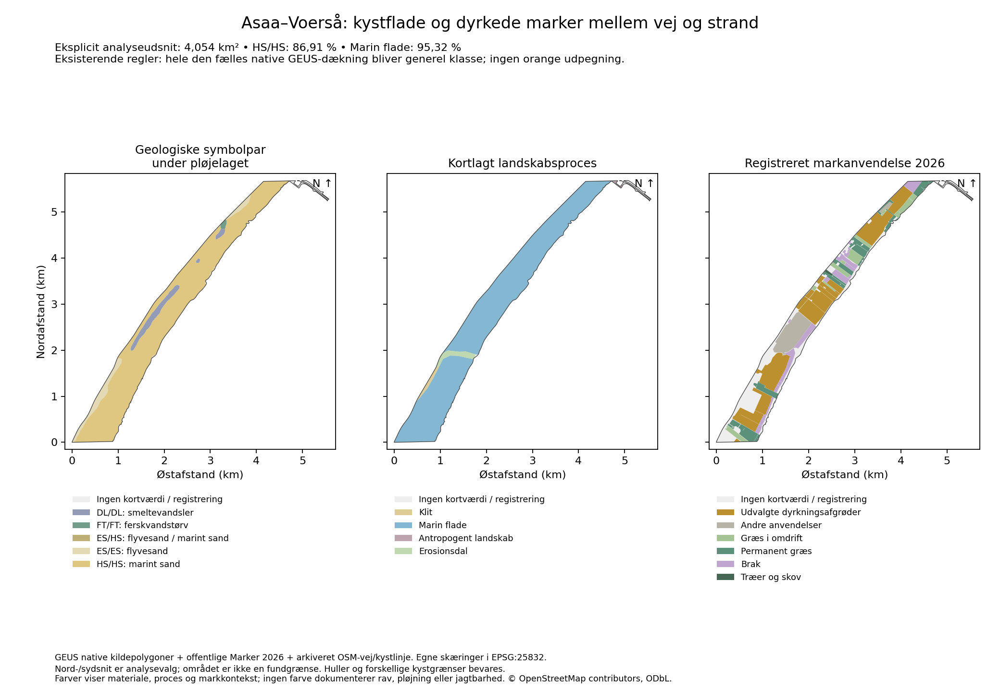

# Asaa–Voerså: jordrav på kystmarker og en konkret mangel i prioriteringen

> Historisk kortstatus: denne rapport blev udført med model 0.1.
> Nationale farver og klasseregler er siden revideret i
> [model 0.2](JORDRAV_NATIONAL_MODEL_0_2.md). Rapportens kildeobservationer
> bevares; udsagn om frosne regler, guide-only levering og åbne nationale
> farveændringer er supersederet. Gamle regelbundne audits reproduceres
> fra commit eee7b08e.

**Dato:** 4. oktober 2026. **Status:** kildebaseret regional analyse og lokal UI-rettelse. Model/data er fortsat den frosne 0.1.0-prototype; appversion 4.0.541. Ingen offentlig release.

**Konklusion:** Ejerens præcisering peger på et relevant kystmarkmiljø, som den eksisterende model ikke udpeger særskilt. I et eksplicit udsnit mellem forbindelsesvej og kyst er 86,91 % kortlagt som HS/HS, og 95,32 % som Marin flade. Der findes registrerede dyrkningsmarker på den flade. Hele den fælles native GEUS-dækning får alligevel den generelle klasse `possible`. Dette er en konkret begrænsning i reglernes regionale prioritering. Det er ingen negativ ravvurdering af markerne.

## Ejerens observation og afgrænsningen

Ejeren oplyser, at der bliver fundet meget jordrav på engene/markerne mellem Asaa og Voerså. På spørgsmålet om et mere præcist sted svarer ejeren: **“mellem stranden og vejen de forbinder de 2 byer.”** Oplysningen kommer fra den aktuelle samtale. Der er ingen præcise fundpunkter, optælling eller datoer for de enkelte fund.

Erfaringen er **positiv lokal støtte** for rav i et tilgængeligt lag i dele af bæltet. Den må ikke reduceres til manglende evidens, fordi den ikke er en struktureret database. Den dokumenterer heller ikke ens ravindhold i alle marker. Tidligere fund er fortsat ikke et krav for at udlede andre geologisk begrundede muligheder.

Den undersøgte forbindelsesvej er rute 541, **Sæbyvej og Østkystvejen**. Søråvej er ikke forbindelsesvejen gennem hele strækningen. Vej- og kystlinjerne er hentet fra OpenStreetMaps eget offentlige kort-API; kun geometri, vejtype/-navn, rutenummer, kysttag og to bypunkter er arkiveret. Den minimale projektion er afledt og er ikke et uændret API-råsvar. [ODbL og attribution](https://www.openstreetmap.org/copyright) bevares.

Vi vælger bæltet øst for vejlinjen og vest for den arkiverede kystlinje mellem breddegrader **57,1538585 og 57,2038844**. Snittene ligger i strækningen mellem byerne og gør undersøgelsen gentagelig. De er vores analysevalg og er hverken bygrænser, feltobservationer eller fundgrænser. Resultatet er **4,053539 km²**, inklusive små kystfragmenter. Det er ikke en opmåling af alle de steder, ejeren har omtalt.

En første, bred navigationsboks omfattede også bagland vest for vejen. Den bruges ikke til de følgende tal. Navnefiltreret Overpass gav HTTP 406; det var ingen gyldig vejgeometrikilde. Det offentlige OSM-kort-API leverede i stedet rute 541 og kystlinjen. Et forsøg på at behandle en breddegradsafklippet kyst som én linje fejlede: klippet har flere dele ved kystens sving. Den endelige producent danner først den gyldige vej-/kystpolygon og klipper derefter; ingen dele fjernes eller repareres automatisk.

## Hvad de faktiske kildepolygoner viser

GEUS' cm-normaliserede native kildegeometri bruges til arealer og skæringer. Generaliserede browserflader bruges alene i en separat kontrol af den viste klasse. Jordartskilden er [GEUS 1:25.000](https://doi.org/10.22008/FK2/SQI9ZB); landskabskilden er [GEUS' geomorfologiske kort](https://doi.org/10.22008/FK2/0U6ERA). Originalfiler, attributter og cacheidentiteter er SHA-bundet til de eksisterende audits.

| Jordartens øvre/dybere symbol | Areal i udsnittet | Andel af hele udsnittet |
|---|---:|---:|
| HS/HS, saltvandssand | 3,522931 km² | 86,910 % |
| ES/ES, flyvesand | 0,241233 km² | 5,951 % |
| DL/DL, smeltevandsler | 0,210718 km² | 5,198 % |
| FT/FT, ferskvandstørv | 0,018861 km² | 0,465 % |
| ES/HS, flyvesand over kortlagt saltvandssand | 0,000990 km² | 0,024 % |

HS/HS betyder to ens kortsymboler i GEUS' geologiske kortlægning under pløjelaget. Det er ikke en målt profil fra jordoverfladen ned til en meter og angiver ikke ravets dybde. ES/HS fastlægger heller ikke flyvesandets tykkelse.

| Kortlagt landskabsform | Areal | Andel af hele udsnittet |
|---|---:|---:|
| Marin flade | 3,863926 km² | 95,322 % |
| Erosionsdal | 0,097158 km² | 2,397 % |
| Klit | 0,047678 km² | 1,176 % |
| Antropogent landskab | 0,009948 km² | 0,245 % |

Ingen af de fem udvalgte landskabsposter er klassificeret som Strandvold. Det udelukker ikke mindre eller udjævnede gamle kystformer. En bred geomorfologisk enhed beskriver et andet detaljeniveau end en bestemt pløjet mark eller et tyndt opskylslag.

**Forskellige kystgrænser bevares:** nyere jordarter dækker 3,994733 km² af OSM-udsnittet og efterlader 58.805,646 m² uden den kilde. Geomorfologi dækker 4,018710 km² og efterlader 34.828,733 m². Fælles native dækning er 3,993246 km², **98,513 %** af udsnittet. Kilderne har forskellige grænser og kortaldre; forskellene bliver ikke udfyldt, kaldt ravfattige eller brugt som en positionsnøjagtighed. De to geologiske lag har hver 0,000000 m² rapporteret regionalt overlap.

Figurens farver viser materiale, proces og markkontekst. De er ikke prototypens potentialefarver. Ens akser og bevarede huller gør det muligt at sammenligne de samme arealer.

## Forbindelsen til dyrkede marker er konkret

Det offentlige [Marker 2026-råsvar](jordrav/sources/asaa-fields2026-binding.json) er afgrænset til egnen og indeholder 399 poster; `numberMatched`, `numberReturned` og faktisk antal er ens. Kun geometri, afgrødekode og afgrødenavn samt tekniske feature-ID'er er hentet. ISO-8859-1 og oprindelige bytes bevares i arkivet; der er ingen ejer-/CVR-/marknummerfelter.

**77 poster** har positivt areal i vej-/kystudsnittet. Deres union er **3,099032 km²**. Den eksisterende, udtrykkelige dyrkningsselektion fra Stenstrup-analysen giver **1,536614 km²**; den omfatter udvalgte korn-, majs-, raps- og andre dyrkningsafgrøder. Omdriftsgræs, permanent græs, brak, øvrige anvendelser og træer vises særskilt. Uden registrering er ikke det samme som udyrket.

Af dyrkningsudvalget ligger **1,386771 km² / 138,68 ha** på netop **HS/HS + Marin flade**. Det viser et sammenfald mellem den relevante marine modtagerhypotese og registreret dyrkning. Det viser ikke dagens pløjning, bar jord eller bestemt ravmængde. De registrerede markarealer er årlig kontekst, og deres areal giver ingen klassebonus.

## Landskabshistorien og ravhypotesen

Brønderslevs analyse beskriver Asaa-egnens østkyst som hævet/inddæmmet havbund med gamle strandvolde, dyrkede enge og kystnære strandenge. Den beskriver desuden, at fine partikler og planterester kan blive tilbage i det rolige kystmiljø. Det støtter en modtagerhistorie. Analysens område er kommunens kyst; det må ikke udstrækkes til hele Asaa–Voerså-bæltet uden de lokale kildepolygoner. Den omtaler ikke ravfund. [Landskabsanalyse, trykt s. 30–31](https://bronderslev.viewer.dkplan.niras.dk/media/2339791/Landskabsanalyse-for-Broenderslev-Kommune_lav-oploesning.pdf).

En fagbog beskriver strandvolde, beskyttede tilgroningsforlande og hævet havbund som forskellige dele af marine forlande. Den beskriver også den historiske forskydning af kystzonen udad i det nordøstlige Danmark. Det er regional processtøtte, ikke en lokal højdekurve eller datering. [Vestergaard 2000, trykt s. 30–32](https://mst.dk/media/f0wdavzp/strandenge-en-beskyttet-naturtype.pdf).

Miljøstyrelsens N14-basisanalyse omtaler græs og vinterafgrøder omkring Sørå Mark, Aså og Voerså By. Den er supplerende geografisk landbrugskontekst fra overvågningsperioden 2004–2017, ikke en 2026-pløjeobservation. De aktuelle markskæringer bygger på Marker 2026. [N14, trykt s. 83](https://mst.dk/media/nufpbamn/n14-revideret-basisanalyse-2022-27-aalborg-bugt_randers-fjord_mariager-fjord.pdf).

**Egen primær arbejdshypotese JH-018:** Et muligt ravmateriale er tilført og omlejret i et tidligere kystmiljø, afsat i kystsand eller mindre opskyls-/organiske lag og bevaret, mens arealet blev land. Senere jordbearbejdning kan nå en del af dette materiale; regn kan forbedre synligheden af fremvendte stykker. Ejerens erfaring støtter det sidste led lokalt. Kildepolygonerne og landskabshistorien støtter modtagermiljøet. Ravets præcise fødesediment, aflejringstid, koncentration og lagdybde er ikke fastlagt.

Alternative eller supplerende kæder skal holdes åbne:

- **JH-019, tidligere opskyl på lave enge:** Episodisk havpåvirkning kan have tilført let materiale til en lav kystflade, som senere blev dyrket. En nutidig nærhed til havet afgør ikke, hvornår eller om en bestemt mark blev oversvømmet. Historiske kystkontakter og synlige lag kan afklare forløbet.
- **JH-020, senere lokal omlejring:** Vandløb, grøfter, erosion eller flytning af jord kan have samlet eller spredt materiale i et senere bearbejdet lag. Et tilgængeligt markfund behøver derfor ikke ligge i sit oprindelige marine aflejringslag. Lokale profiler og oplysninger om jordens historie kan skelne kæderne.

Den [tidligere transportanalyse](JORDRAV_TRANSPORT_PLOEJELAG_2026-10-04.md) viser, hvorfor mineralsk kornstørrelse alene ikke er en ravsorteringsmodel. Et dominerende sand-/lersymbol kan skjule et tyndt relevant lag. Vi indfører ingen regel om, at rav altid flyder, at alt organisk opskyl indeholder rav, eller at en rolig kyst automatisk har høj koncentration. Stensnæs-reservatets lagune nord for Voerså anvendes ikke som dokumentation af markerne syd for byen.

## Den eksisterende model overser denne sammenhæng

Den frosne model gør `marine-coarse + shore` forhøjet. **`marine-coarse + marine` er ikke et forhøjet par**. HS på Marin flade bliver derfor `possible`; her sker det også, hvor Marker 2026 viser dyrkning. Alle 3,993246 km² i fælles native dækning bliver generel klasse, og ingen af dem bliver orange. Afvigende øvrige materialer vurderes heller ikke forhøjede i dette udsnit.

En uafhængig læsning af originale SHP/DBF-filer bekræfter symbolerne. Et diagnostisk punkt inde i en stor HS-/marinflade-/dyrkningsskæring rammer også den faktisk publicerede lokale visningsfil: `n192998:g7400`, katalog 39, `possible`. Punktet er valgt af analysen og er **ikke et ravfund**. Dermed er den manglende udpegning efterprøvet både i reglerne og i de konkrete kortdata; den skyldes ikke, at browseren blot glemte en orange flade.

Den generelle klasse havde dækket ca. 83,31 % af det allerede analyserede, generaliserede nationale visningsareal. Dette er ikke en præcis national landarealandel. Den grønne fyldflade var derfor en dårlig visning af særskilte muligheder. Den er fjernet i potentialevisningen, mens geometrien fortsat kan klikkes. Teksten er nu **Generel geologi · ingen særskilt udpegning**. Den angiver hverken undersøgelsesdybde eller fravær af ravmuligheder. Den eksplicit valgte jagtbarhedsvisning viser fortsat gråblå/uafklaret og dybe punktlag lilla.

**Kortændring og bredere analyse:** Asaa–Voerså er tilføjet som sjette regionale guide på DA/DE/EN. Guiden viser modtagerhypotesen, ejerens støtte og modelmanglen og kan flytte kortet til strækningen. Visningsrammen er lidt større end analyseudsnittet; den tegner ingen ravgrænse. Ejerens efterfølgende præcisering er bindende: Asaa er et eksempel til generalisering, ikke en lokal særrettelse. En [national marine diagnose og fem nye sammenligninger](JORDRAV_TIDLIGERE_KYSTMARKER_DANMARK_2026-10-04.md) undersøger derfor Hals–Hou, Jerup–Ålbæk, Lammefjord, Rødbyfjord og Hjardemål. De har også guide, så kortet nu har 11. Den nationale prioriteringsmodel er fortsat åben.

## Konsekvens for den næste model

En begrundet regional efterfølger skal kunne genkende **tidligere kystmodtager → landdannelse/bevaring → bearbejdet overfladelag**. Den kæde må kunne udledes også uden tidligere fund. Dagens afstand til kysten eller kombinationen marint sand/mark er utilstrækkelig alene.

Følgende kontrakter bør gælde før en ny klassebygning:

1. Vurder marine flader, mindre gamle kystformer og finere/organiske modtagere i den regionale kysthistorie; en grov landskabskode må ikke være et obligatorisk strandvoldskrav.
2. Skeln mellem senglaciale havlag, holocæne kystforløb og senere overlejring. De har ikke samme forventede lagposition. DL på en bred Marin flade skal undersøges særskilt; det bliver ikke marint sand ved områdebonus.
3. Angiv, hvilke led der er kildeunderbyggede, plausible eller uafklarede. Ejererfaring er lokal støtte; geologien skal fortsat kunne skabe muligheder andre steder.
4. Hold regionalt potentiale og jagtbarhed adskilt. En registreret årsafgrøde verificerer ikke et bestemt lag i pløjelaget. En lokal erfaring med tilgængeligt rav bliver heller ikke en verificeret nutidig tilstand for alle marker.
5. Vis forskningsdækning særskilt fra potentialeklasse. Hverken generel klasse, fravær af orange eller ufarvet kort må betyde “ikke analyseret” eller “ingen rav”.
6. Efterprøv både denne kystcase, Stenstrups bassinmiljø og modcases med dybere/overlejrede marine sedimenter. Det skal forhindre en ny, landsdækkende standardfarve uden lokal begrundelse.

De frosne regler og producerede polygoner er ikke ændret i dette arbejde. JORDRAV-001 og JORDRAV-007 er stadig åbne; JORDRAV-009 fastholder denne konkrete kystmangel og forskellen mellem udpegning og forskningsstatus. At fjerne grøn løser læsbarheden, ikke den faglige mangel.

## Gentagelighed og kontrol

[Producent](jordrav/audit_asaa_voersaa.py), [audit](jordrav/asaa-voersaa-audit-2026-10-04.json) og [afledt geometri](jordrav/asaa-voersaa-context-2026-10-04.geojson) binder kilde-/regel-/scriptidentiteter. Alle arealer er egne EPSG:25832-skæringer uden buffer eller ny snapping. Klasse-/parpartitionen af fælles native dækning stemmer ved 1 m² numerisk tolerance; det er ingen geografisk nøjagtighed.

[Originalkontrol](jordrav/verify_asaa_voersaa.py) og [resultat](jordrav/asaa-voersaa-original-verification-2026-10-04.json) bruger originale koordinater og samme bounde undersøgelsesgeometri. Otte jordartsposter og fem landskabsposter er efterprøvet. Jordartsdækning afviger 1,171 m² og landskabsdækning 0,011 m² fra native audit; største enkeltpostafvigelse er 1,327 m². En original HS-post har en kendt ring-selfintersection og behandles kun i hukommelsen. Markunion beregnet før klipning afviger 0,000220 m² fra producenten. Kontrollerne verificerer beregning og kildeidentitet, ikke ravhypotesen.

[Figurproducent](jordrav/plot_asaa_voersaa.py), [binding](jordrav/asaa-voersaa-figure-binding-2026-10-04.json) og [litteraturidentiteter](jordrav/asaa-voersaa-literature-2026-10-04.json) er bevaret. Figuren og alle relevante PDF-sider er visuelt gennemgået. De offentlige minimale OSM- og WFS-kilder er arkiveret; større GEUS-originalfiler er SHA-bundne eksterne forudsætninger.

Målrettet kortkontrol omfatter 18 browserchecks med reelle klik, 11 regionale guides, ufarvede flader, begge baggrunde, jagtbarhed, dybe punkter, mobil og DA/DE/EN. Skærmbilleder venter på synlige kortfliser. Endelige kontroller og scope registreres i [RDKS-checkpointet](../rdks/30_RESEARCH/JORDRAV-KORT-2026-10-04.md). Lokal kontrol er ikke CI eller produktionsverifikation. Ingen ny app-/modelversion, vejrindsamling, push, merge eller deploy.
