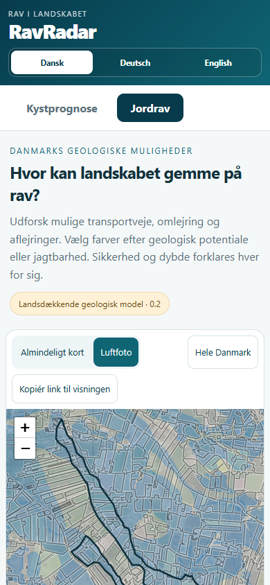
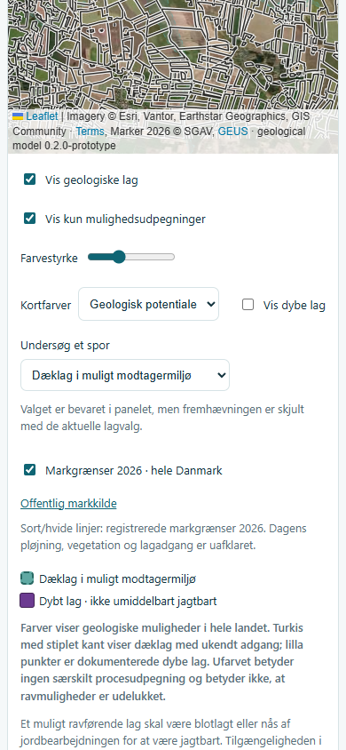

# Jordrav: undersøg ét spor og genfind søgestedet

Ejerens “kan det gøres endnu bedre?” er omsat til en konkret forbedring
af, hvordan hele den nationale analyse bruges til at vælge søgesteder.
Grundlaget er den lokale baseline 44192cf4, model 0.2.0-prototype og
søgevejledning 0.1.0. Appen er fortsat 4.0.541.

## Hvor forbedringen hjælper

Farverne beskriver forskellige sedimentkæder. En bruger, der vil
undersøge tidligere marine markflader, skal kunne isolere blå muligheder
og sammenholde dem med markgrænser og luftfoto. Samme funktion skal gælde
transport/sortering, bassiner, omlejring og dæklag i hele Danmark.
Det er et arbejdsfilter, ikke en rangordning af ravchancer.

En konkret udvalgt flade skal også kunne genfindes med dens forklaring,
kortsted og lagvalg. Kilde-ID alene er utilstrækkeligt: detaildatasættet
kan have flere klippede fragmenter af samme kildepost. Linket bruger
både oprindelse og fragmentets faktiske bounding box med otte decimaler,
bundet til den uændrede nationale manifest-SHA256.

## Implementeret

*Undersøg et spor* vælger alle eller én af fem mulighedsklasser. Den
samme kategori filtrerer overblik og detaljer; overbliksfiltrering henter
ingen detailfliser. Ved alle spor kan det eksisterende fokus fortsat
skjule generel/uafklaret geologi. Et konkret spor er allerede et sådant
udvalg. Dybe punkter styres særskilt. Farveforklaringen følger valget.
Valgt forklaring bevares, mens fremhævningen skjules, hvis laget eller
sporet er slået fra; det forklares med en synlig besked.

*Kopiér link til visningen* gemmer center/zoom, baggrund, spor, farvetilstand,
farvestyrke, fokus, geologilag, markgrænser, dybe punkter og eventuelt valg.
Linket står også i et readonly tekstfelt. Browserens clipboardfejl giver
manuel kopiering. Kopiering sender ingen besked og gemmer intet på en
server. Koordinater og valg står i URL-fragmentet; brugeren bestemmer
selv, om linket skal gemmes eller deles. Lokal localhost er fortsat kun
preview på samme computer, ikke en fælles internetadresse.

Ved genåbning gendannes det præcise detailfragment fra de lokale
viewportfliser. Ændret datasetbinding fjerner tidligere polygon-/dybdevalg
med en eksplicit besked og beholder sted og indstillinger. Manglende
fragment eller ukendt dybdepunkt erstattes aldrig af en nærliggende
polygon. Panelets tidligere forklaring ryddes ved et nyt linkvalg.
Ugyldige felter, dubletter, ukendt format, urimelige koordinater/zoom
eller et link over 1.200 tegn afvises. Andre almindelige HTML-ankre
fortolkes ikke som gemte kortvisninger.

Polygonvalg uden for den lokale detailvisning medtages ikke ved kopiering,
og udeladelsen forklares. Ved et manuelt link med skjult geologi eller
for lille zoom afventer valget synlige detaljer; indlæsningsfejl er
eksplicitte. To hurtige linkskift under kortbevægelse bevarer det seneste
ønske, og gammel regional navigation kan ikke overtage linkets kamera.

Leaflets GeoJSON-filter anvendes ved oprettelse af laget; derfor genbygges
visningslaget ved filterskift. [Leaflet 1.9.4 dokumentation](https://leafletjs.com/reference.html#geojson-filter).
Clipboard-adgang kan afvises, så tekstfeltet er en del af funktionen.
[MDN: Clipboard.writeText](https://developer.mozilla.org/en-US/docs/Web/API/Clipboard/writeText).

## Hvad der fortsat afgør en god mark

Den nationale fysiske diagnose og materialevejledning fra forrige trin
bevares. 3.489 blå detailfeatures med organisk materiale og 9.919 med
almindelige sammensatte øvre symboler må fortsat ikke sælges som rent sand,
lodret dæklag eller dokumenteret pløjeadgang. Tallene tæller fragmenter.
Alle fem spor beskriver muligheder uden at kræve tidligere fund.

Den næste faglige forbedring kræver lokale oplysninger, der forbinder
det relevante sediment med dagens blotlagte jord eller bearbejdede lag.
Eksisterende markregistrering og luftfoto afgør ikke dæklagets tykkelse,
aktuel pløjning eller ravtilførsel. Ingen ekstra fundprocent, markbonus
eller automatisk ændring af jagtbarhed indføres uden den forbindelse.
Det åbne empiriske led er særskilt fra den afsluttede landsdækkende
behandling af det tilgængelige kortgrundlag.

## Kontrol

Fire nye kontrakttests kontrollerer filtre, samtlige kontrolvalg i links,
fragmentidentitet, afvisning af fejlagtige links og alle 505.834 nationale
detailoprindelser med faktisk beregnede bbox. Alle referencer er entydige.
Originale ID'er med `?` og `+` bevares; de betyder ikke
nye eller ændrede geologiske poster. 17 modelcases, fem artifacttests og
fire eksisterende materialekontrakter består også.

15 nye faktiske Chrome-kontroller består: fem nationale filtre, lokale
filtre/valg, clipboard, ny browserkontekst, præcis flade-/forklarings-
gendannelse, ændrede/manglende data, dybe intervalvalg, ugyldige links,
hurtig navigation, 390 px/DA-DE-EN og manuel kopiering ved clipboardfejl.
Lange sporvalg passer inden for panelet, også på mobil. Kopiering under
indlæsning bevarer et afventende valg; udeladt polygon forklares også ved
manuel kopiering.
[Link-/filterkontrol](jordrav/planning-2026-10-05-browser-audit.json).
De 20 eksisterende kortkontroller og otte materiale-/markkontroller består
på denne UI med separate outputnavne; historiske audits bevares.
[Kortregression](jordrav/planning-regression-2026-10-05-browser-audit.json),
[Materiale/mark](jordrav/planning-context-browser-2026-10-05.json).

Sourcegate/112 browserfiler, RDKS/sikkerhed, 62 Pages-moduler, versionsimports
og 419 håndbogskapitler PASS. Beskyttet path-diff er tom: model/datasæt,
fysisk søgevejledning, markservice, aktiv webhåndbog, kyst-/vejrdata og
produktionskode er uændrede. Screenshots er visuelt læst. Ingen CI, push,
merge, release eller produktionsbevis.
[Samlet lokal kontrol og binding til kode/data](jordrav/planning-validation-2026-10-05.json).

