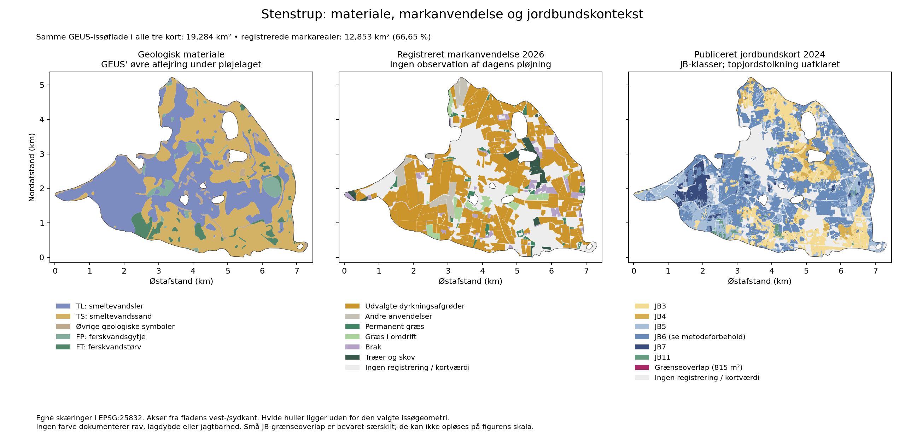

# Stenstrup: fra geologisk mulighed til konkret markkontekst

> Historisk kortstatus: denne rapport blev udført med model 0.1.
> Nationale farver og klasseregler er siden revideret i
> [model 0.2](JORDRAV_NATIONAL_MODEL_0_2.md). Rapportens kildeobservationer
> bevares; udsagn om frosne regler, guide-only levering og åbne nationale
> farveændringer er supersederet. Gamle regelbundne audits reproduceres
> fra commit eee7b08e.

**Dato:** 2026-10-04. **Status:** lokal forskningsanalyse. App 4.0.541 og det frosne geologiske datasæt 0.1.0-prototype er uændrede. Dette er en supplerende analysefigur og kildedokumentation; mark- og JB-lagene er endnu ikke integreret i den interaktive prototype.

Den nye undersøgelse forbinder den allerede analyserede issøflade med faktiske markregistreringer fra 2026. **12,853 km², svarende til 66,65 % af fladen, har markregistrering.** Dermed bliver det muligt at undersøge forskellige geologiske modtagere i en konkret dyrkningskontekst. Et registreret markareal dokumenterer hverken pløjning, bar jord, lokal adgang eller rav. Tidligere ravfund er fortsat ikke en forudsætning for en undersøgelseshypotese.

## Beregning og kilder

Afgrænsningen er hele GEUS' native **Issøflade, kildepolygon 10265**, på 19,284406 km², som i [kontaktanalysen](JORDRAV_STENSTRUP_KONTAKTER_2026-10-04.md). De samme 149 nyere jordartsposter indgår. Den grovere landskabsgrænse er en regional fortolkning, ikke en markgrænse eller et ravareal.

Fra ministeriets offentlige WFS er der den 4. oktober 2026 hentet to komplette, afgrænsede svar i EPSG:25832:

| Kildelag | Modtaget i fladens omsluttende rektangel | Poster med positivt areal inde i den valgte issøflade | Hentede egenskaber |
|---|---:|---:|---|
| `Marker:Marker_2026` | 641 | 311 | Afgrødekode og afgrødenavn samt geometri |
| `Jordbunds_og_terraenforhold:Jordbundskort_2024` | 8.284 | 5.186 | Publiceret JB-kode og jordtypenavn samt geometri |

Der er ikke hentet ejer-, CVR-, journal- eller marknummerfelter. Kildens offentlige tekniske feature-ID følger råsvaret; det indgår ikke i figurens opløste flader. Arealer skæres til landskabsgeometrien og sammenlægges før optælling. En delvist overlappende kildepost tælles derfor ikke som en hel mark eller et ekstra areal. De 311 poster er ikke 311 ejendomme eller nødvendigvis 311 selvstændige jagtsteder.

[Officiel adgang til kortdata](https://lbst.dk/bedrift/arealer-og-ejendomme/kortdata/adgang-til-kortdata), [offentlig dataoversigt](https://landbrugsgeodata.fvm.dk/) og [WFS-kapabiliteter](https://geodata.fvm.dk/geoserver/ows?service=WFS&request=GetCapabilities). De præcise forespørgsler, svartider, charset, antal og SHA-256-identiteter er bevaret i [markbindingen](jordrav/sources/stenstrup-fields2026-binding.json) og [JB-bindingen](jordrav/sources/stenstrup-jb2024-binding.json). Det er datalagets afgrødeår, ikke bevis for den aktuelle tilstand på en bestemt dato.



*Egen figur fra de kontrollerede kilder. Hvide huller ligger uden for den valgte landskabsgeometri; grå felter indenfor mangler registrering eller JB-værdi. Ingen af farverne viser rav eller verificeret jagtbarhed. JB-grænseoverlap er særskilt bevaret, men for smalle til at kunne opløses på denne figur. TS/TL er proglaciale smeltevandskoder. Jordbunds- og geologikortets farver må ikke sidestilles.*

## Dyrkningskontekst uden antaget pløjning

En eksplicit gruppe med 20 afgrødekoder omfatter udvalgte korn-, majs-, raps-, bælg-, rod- og grøntsagsafgrøder. Den dækker **9,822 km² / 982,18 ha**, svarende til **50,93 % af hele issøfladen**. Den er et praktisk undersøgelsesudvalg, ikke alle arealer der kan blive pløjet. Frøafgrøder, jordbær og andre anvendelser kan også indebære jordbearbejdning, men føres her under andre registrerede anvendelser frem for at få en udokumenteret pløjefrekvens.

| Registreret kontekst | Areal inde i issøfladen, ha |
|---|---:|
| Udvalgte dyrkningsafgrøder | 982,18 |
| Græs i omdrift | 66,14 |
| Permanent græs | 36,00 |
| Brak | 72,59 |
| Træer og skov | 52,14 |
| Andre registrerede anvendelser | 76,27 |
| Ingen markregistrering | 643,12 |

Koderne er **1, 3, 4, 5, 7, 10, 11, 13, 14, 15, 22, 30, 31, 152, 161, 210, 214, 216, 434 og 450**. Øvrige grupper følger kildebetegnelserne med omdrift, permanent græs, brak og træer/skov. Arealerne er geometriske skæringer, ikke indberettede hele markarealer. Små kildeoverlap giver mindre end 0,06 m² forskel mellem rå sum og union; afrundede tabelrækker behøver ikke summere præcist.

**Vores praktiske slutning:** Det er nu meningsfuldt at undersøge, hvilke sedimentmiljøer der findes i dyrkningsgruppen, og senere sammenholde dem med faktisk bar jord. Permanent græs eller skov kan have relevant geologi, men registreringen giver ikke forventning om blotlægning ved almindelig pløjning nu. Årsafgrøden kan heller ikke fortælle, om en dyrkningsmark er pløjet, dyrket uden plov, dækket af planter eller klar til at gennemgå efter regn. Ingen bestemt pløjedybde eller kalenderdato antages.

## Modtagermiljøer på markarealer

Nedenstående skæringer bruger kun geologi og markdata. De afhænger **ikke** af, om JB-kortet har værdi på stedet.

| Øvre geologisk materiale | På alle registrerede markarealer, ha | I udvalgt dyrkningsgruppe, ha |
|---|---:|---:|
| TS – proglacialt smeltevandssand | 579,08 | 460,00 |
| TL – proglacialt smeltevandsler | 535,99 | 402,13 |
| FT – ferskvandstørv | 66,91 | 47,73 |
| FP – ferskvandsgytje | 59,96 | 42,17 |
| FS – ferskvandssand | 5,64 | 3,45 |

Dette styrker muligheden for at undersøge både sand, ler og yngre organiske modtagere på marker. Det dokumenterer ikke, at sand er bedre end ler, eller at alle arealer modtog rav fra et relevant lager. Topjord kan være blandet, omlejret eller adskilt fra GEUS' kortlagte aflejring under pløjelaget.

Af de tidligere målte **44,47 km interne TS–TL-nabogrænser** ligger **30,98 km** inden for markregistreringerne og **22,80 km** i den udvalgte dyrkningsgruppe. Længden beskriver kortgeometrien; der er ingen fast søgekorridor, kontaktbonus eller forventet fundmængde pr. kilometer. En lateral grænse beviser ikke en bestemt lodret lagkontakt. Kortets stednøjagtighed understøtter heller ikke at følge linjen præcist med GPS på en mark.

Det mest nyttige nye spor gælder de fem allerede undersøgte kildeposter med yngre dække:

| Øvre/dybere symbolpar | Hele parrets kortareal, ha | På registrerede markarealer, ha | I udvalgt dyrkningsgruppe, ha |
|---|---:|---:|---:|
| FT / TS, to kildeposter | 11,74 | 11,03 | 7,31 |
| FP / TL, to kildeposter | 26,18 | 23,57 | 19,52 |
| FT / TL, én kildepost | 19,01 | 18,58 | 12,77 |
| Samlet | 56,93 | 53,18 | 39,60 |

**Vores fortolkning:** Disse dækkede miljøer kan undersøges i dyrkningskontekst og er ikke blot et abstrakt lagspørgsmål i udyrket terræn. FT over TS er dog stadig ikke dokumentation for, at en plov når sandet. Det øvre organiske lag kan selv være en modtager, mens den dybere enhed forbliver utilgængelig. Lagtykkelse, sammenhæng og nutidig blotlægning afgør, hvilken kæde der faktisk er relevant.

## Hvorfor JB-kortet ikke får en rav- eller topjordsbonus

AU's martsrapport beskriver modellerede teksturer i flere dybdeintervaller med en nominel 10 m opløsning. Geologi og historiske areal-/satellitdata indgår som modelinput. Derfor er JB og GEUS ikke uafhængige ravbeviser; modelusikkerheden er ikke en ravsandsynlighed. Historiske satellitkompositter dokumenterer ikke bar jord i dag. [Møller, Greve og Beucher 2024, metode s. 14–18 og JB-inddeling s. 39](https://pure.au.dk/ws/files/372695357/Opdateret_jordbundstypekort_1903_2024.pdf).

Majrevisionen opdeler topjordsklassen JB4 efter underjordens klasser i 30–100 cm. Notatet beskriver LBST's administrative omklassificering JB41→JB4 og JB42→JB6 og advarer om, at et topjordsbaseret tørvedybdekort ikke dækker al begravet tørv. [Greve 2024, s. 3](https://pure.au.dk/ws/files/378595646/Revidering_jordbundstypekort_1705_2024.pdf).

**Konsekvensen for vores analyse:** Det hentede WFS-lag har JB3, 4, 5, 6, 7 og 11, uden 41/42 eller felter til at genskabe omklassificeringen. Hvilken del af det konkrete lag der er oprindelig JB6, er ikke afklaret. Vi bevarer derfor de publicerede koder og kalder dem **publicerede JB-klasser**, uden at hævde en entydig prøve af 0–30 cm. En JB6-flade over geologisk TS er hverken bevist topjordsler, en sikker kildekonflikt eller tegn på rav.

JB-kortet dækker **15,173 km²** af issøfladen. **0,214 km² / 21,36 ha** registreret markareal mangler JB-værdi. Hullerne fyldes ikke med gættede klasser. Trevejsskæringer mellem geologi, markkontekst og JB findes i auditresultatet, men er beskrivende kontekster og ændrer ingen potentiale- eller jagtbarhedsklasse. JB11 og FT er heller ikke ens kategorier: en topjords-/administrativ humusklasse kan ikke erstatte kortlagt ferskvandstørv eller måle dens tykkelse.

## Kildegrænser og faktisk fejlbehandling

Den første audit stoppede på overlappende JB-klasser. De positive overlap består af mange små grænsefragmenter; største enkeltfragment i de målte klassepar er **0,720 m²**. Samlet overlap-union er **815,123 m²**, heraf **745,517 m²** på registreret markareal. Det svarer til kun 0,00423 % af issøfladen, men bliver ikke skjult ved en større tolerance eller automatisk valg af jordtype.

**Vores geometriske vurdering:** Fragmenternes størrelse og placering er forenelig med små forskelle langs publicerede kildegrænser. Det er ikke dokumentation for brede naturlige overgangsbælter. Alle positive overlap fjernes fra de entydige JB-klasser og bevares som kategorien **Overlappende kildegrænser**. Den rå klassetabel og alle klassepars overlap findes fortsat i auditresultatet. Grænselinjer/punktberøringer har nul areal og medtages ikke som jordflader.

Første forsøg på differens med overlapgeometrien fejlede, fordi skæringen også indeholdt linjer og punkter. Det er rettet ved eksplicit at bruge arealdelene. Der er ingen snapping, buffere eller reparation af WFS-kildepolygonerne. Den korrigerede JB-partitions restoverlap er 0,0073 m²; trevejssummen afviger 0,0173 m² fra fælles dækningsunion. Numerisk tolerance er 1 m² og beskriver beregningen, ikke kortenes stednøjagtighed. De fejlede forsøg er ikke PASS.

## Nye konkrete hypoteser og næste afklaring

| Spor | Hvorfor det er relevant nu | Hvad kan afgøre det? |
|---|---|---|
| **JH-015: Sammenlignelige sand-/lermarker** | Dyrkningsgruppen rummer ca. 460 ha TS og 402 ha TL samt 22,80 km kortlagt nabogrænse. | Undersøg blotlagte jordprofiler og materiale i det bearbejdede lag på begge sider, med sammenlignelig overfladesynlighed. Afklar lokal modtager og ravtilførsel; areal og kontaktlængde vægtes ikke som ravchance. |
| **JH-016: Dyrkede yngre dæklag/modtagere** | FT/TS, FP/TL og FT/TL rummer tilsammen 39,60 ha i dyrkningsgruppen. | Afklar om ravhypotesen vedrører øvre modtager, dybere lag eller begge. Mål synlig lagfølge, dæklagstykkelse og faktisk jordbearbejdning, før noget klassificeres pløjetilgængeligt. |
| **JH-017: Forbindelse til nutidig topjord** | JB kan beskrive anden jordbundskontekst end aflejringen under pløjelaget; den administrative kode er utilstrækkelig til entydig dybde. | Brug en verificeret ren teksturprofil eller lokal observation med angivet dybde og tidspunkt. En administrativ klasseforskel alene bekræfter eller afkræfter ikke lagforbindelsen. |

De tre spor udpeger, hvad der er værd at undersøge, uden krav om et tidligere ravfund. Fravær af en dokumenteret lokal tilførselskæde er stadig en faglig usikkerhed. Manglende nutidig blotlægning betyder, at et interessant miljø kan være upraktisk at gennemgå nu. Dybe muligheder må fortsat vises særskilt efter ejerens beslutning; ukendt lagtykkelse bliver ikke kaldt dybt eller jagtbart.

Den praktiske rækkefølge er nu: **geologisk modtager → registreret anvendelse → faktisk blotlægning og lagforbindelse → regnens afvaskning/synlighed**. Et luftfoto kan hjælpe med landskabsorientering, men dets optagedato skal passe, hvis det skal bruges til overfladetilstanden. Denne analyse henter ingen nutidige pløjeobservationer og indfører ingen vejrbonus. Alle materialeflader forbliver **jagtbarhed uafklaret** i kortets jagtbarhedsvisning.

## Gentagelighed og slutkontrol

[Auditproducent](jordrav/audit_stenstrup_field_context.py), [resultat](jordrav/stenstrup-field-context-audit-2026-10-04.json) og [afledt forskningsgeometri](jordrav/stenstrup-field-context-2026-10-04.geojson) er SHA-bundet. De minimale offentlige WFS-råsvar er arkiveret som gzip med uændrede oprindelige bytes og deklareret ISO-8859-1. Ingen ejerfelter er hentet eller gemt. [Kildevejledning](jordrav/sources/README.md).

[Den uafhængige kontrol](jordrav/verify_stenstrup_field_context.py) læser originale GEUS-SHP/DBF-koordinater og arkiverede WFS-bytes, sammenlægger før klipning og bruger ikke producentens WKB- eller kategorihjælpere. [Resultatet](jordrav/stenstrup-field-original-verification-2026-10-04.json) er PASS: markareal afviger 10,194 m² fra den cm-normaliserede analyse, dyrkningsudvalget 8,753 m² og JB-dækning 11,767 m². Kontakten på markarealer afviger 0,056 m. En tidligere kendt ugyldig original jordartspost behandles alene i hukommelsen; originalfiler er urørte. Beregningsenighed verificerer ikke geologi eller rav.

[Figurproducent](jordrav/plot_stenstrup_field_context.py) og [figurbinding](jordrav/stenstrup-field-figure-binding-2026-10-04.json) binder input, script og PNG. Figuren er visuelt gennemgået med bevarede huller, ens akser og læselige tegnforklaringer. Matplotlib ligger fortsat i temp-mappen og føjes ikke til appens runtime.

[PDF-kildeidentiteter og visuelt læste sider](jordrav/stenstrup-field-literature-2026-10-04.json) er bevaret særskilt. Faglige slutninger skelner mellem de læste AU-metoder og den fortsat uafklarede proveniens for det aktuelle WFS-lags administrative klasser.

```text
python -B docs/research/jordrav/audit_stenstrup_field_context.py --source-root <verificeret-GEUS-kildecache> --output docs/research/jordrav/stenstrup-field-context-audit-2026-10-04.json --geometry docs/research/jordrav/stenstrup-field-context-2026-10-04.geojson
python -B docs/research/jordrav/verify_stenstrup_field_context.py --source-root <originale-GEUS-filer> --audit docs/research/jordrav/stenstrup-field-context-audit-2026-10-04.json --geometry docs/research/jordrav/stenstrup-field-context-2026-10-04.geojson --output docs/research/jordrav/stenstrup-field-original-verification-2026-10-04.json
python -B docs/research/jordrav/plot_stenstrup_field_context.py --audit docs/research/jordrav/stenstrup-field-context-audit-2026-10-04.json --geometry docs/research/jordrav/stenstrup-field-context-2026-10-04.geojson --figure docs/research/jordrav/stenstrup-field-context.png --output docs/research/jordrav/stenstrup-field-figure-binding-2026-10-04.json
```

RDKS, issues, håndbog, changelog og det forberedte webhåndbogstillæg følger analysen. Tidligere browserkontroller beskriver den uændrede UI; dette er ingen ny browser-, CI- eller produktionsverifikation. Der startes ingen vedvarende preview. Ingen apprelease, push, merge, deploy eller produktionsvejrhentning indgår.

Slutkontrol: endelige script-/audit-/geometri-/figurbindinger, Python-syntaks, arkiverede kildeidentiteter, lokale links og webtillæg PASS. RDKS/14 chatkilder/håndbog 4.0.541, håndbogens 419 kapitler og eksisterende sikkerhedshærdningskontrakter PASS. Frosne regler, manifest og begge producentkilder har uændrede hashes; særskilt protected-path-diff er tom.
