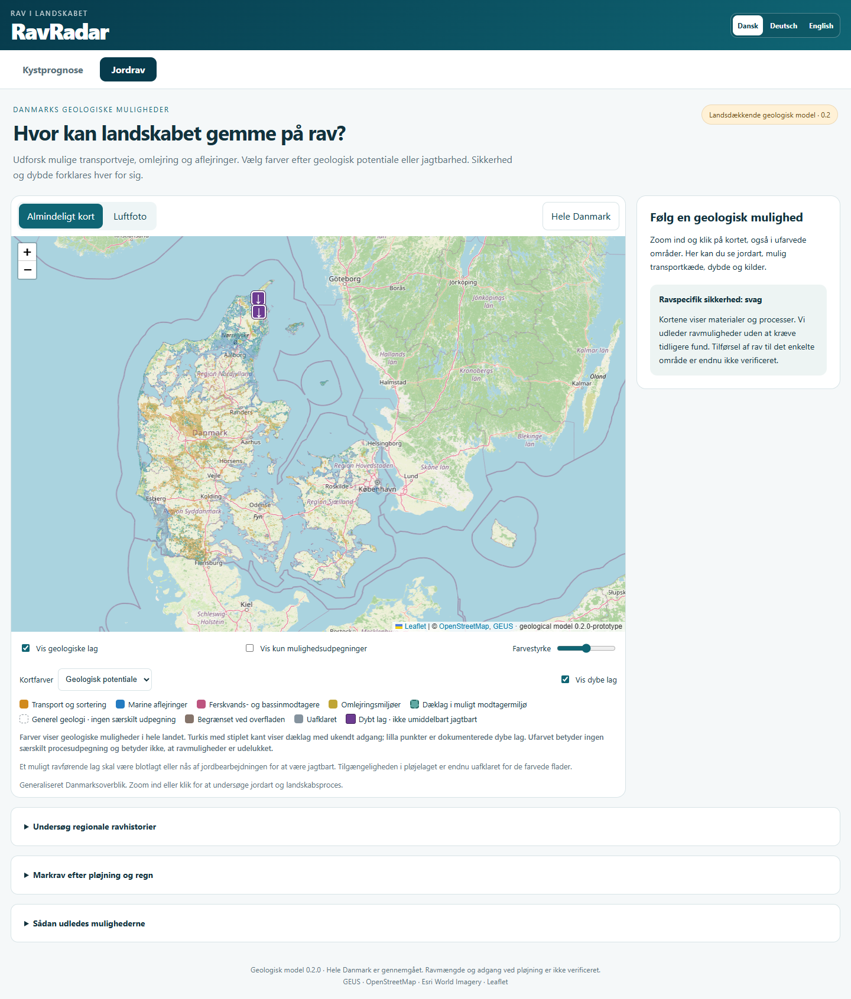
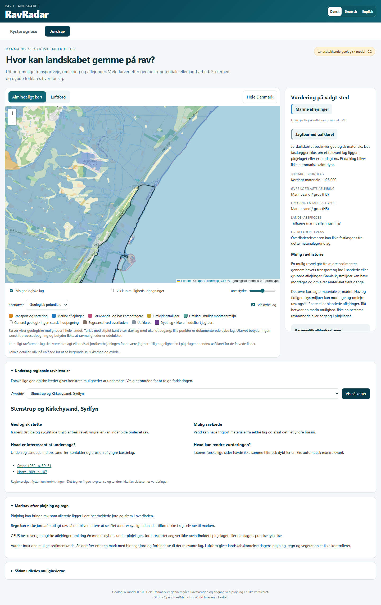

# Jordrav 0.2: landsdækkende analyse og synlige geologiske muligheder

Analyse og lokal rettelse udført 2026-10-04–05.

**Seneste videreanalyse 2026-10-05:** National fysisk materialediagnose,
konkrete søgeopgaver ved klik og valgbare offentlige Marker 2026-omrids
for hele Danmark er tilføjet. Model 0.2 og datasetbytes bevares. Marine
organiske materialer, blandinger og lagadgang præciseres; markregistrering
bliver ikke til jagtbarhed. Se
[materiale- og markanalysen](JORDRAV_SOEGEBARHED_MATERIALE_MARKER_2026-10-05.md).

## Mandat og afgrænsning

Ejeren har afvist en levering, som kun beskrev nye områder i en guide og
lod den nationale farveklassifikation stå uafsluttet. Den aktuelle ordre
er at analysere hele landet og gennemføre rettelsen på kortet. Dette
erstatter den tidligere beslutning om alene at forklare manglen, mens
0.1-reglerne blev holdt frosne. En ny model 0.2.0-prototype beregnes for
alle materiale-/landskabskombinationer og alle nationale detailudsnit.
Appversionen og eksisterende kystgeometri/vejrproduktion ændres ikke.

Det er en færdig landsdækkende **kvalitativ udledning af muligheder fra de
tilgængelige kort**, ikke en påstand om målte ravmængder eller kendt
lagadgang på hver mark. Tidligere fund er ikke et adgangskrav. De konkrete
egne er kontrolcases, aldrig hardcodede positive områdegrænser.

## Den nationale faglige syntese

Muligt ældre ravmateriale kan transporteres, blandes, afsættes og omlejres
af is, smeltevand, ferskvand og hav. Bevaring og senere lagadgang er
forskellige led. Det tidligere krav om groft materiale i få bestemte
landskabsformer var for snævert som udpegning: det udelod marine flader
og finere modtagere, selv når kortene beskrev et relevant aflejringsmiljø.

Marine omlejringsprocesser har ravspecifik støtte i
[Bennike & Jensen 1998, s. 31](https://2dgf.dk/xpdf/bull45-1-27-38.pdf).
Forskellige regionale kysthistorier betyder, at dagens kystafstand og én
fælles højdegrænse ikke kan erstatte de kortlagte marine aflejringer.
[Christensen & Nielsen 2008](https://pub.geus.dk/en/publications/dating-littorina-sea-shore-levels-in-denmark-on-the-basis-of-data/).

Rav i finere yngre bassinaflejringer og ravpindelag viser, at mineralsk
kornstørrelse ikke er en universel ravsorteringsregel. Modtagerbassiner
og finere transport-/omlejringsmiljøer skal derfor kunne give positive
muligheder uden at blive gjort til sikre koncentrationer.
[Hartz 1909, s. 91–107](https://archive.org/details/bidragtildanmark00hart),
[Pedersen 2005, s. 46–48](https://www.geus.dk/media/13810/nr8_p001-192.pdf).
De [regionale kæder](JORDRAV_REGIONALE_KAEDER_2026-10-04.md) og den
[fysiske transportanalyse](JORDRAV_TRANSPORT_PLOEJELAG_2026-10-04.md)
adskiller kildeunderbygning og vores egne overførsler til andre aflejringer.

GEUS kortlægger oprindelige aflejringer omkring én meters dybde, under pløjelaget.
Ens symboler fastlægger ikke adgang ved pløjning, og forskellige symboler
fastlægger ikke dæklagstykkelsen. Derfor bruges dybere sand ikke som en
automatisk positiv **overflade**klasse. Dæklag vises særskilt, og kun
registrerede dybe punktintervaller kaldes dybe.
[GEUS 2025/32, s. 4, 7 og 10](https://data.geus.dk/pure-pdf/GEUS-R_2025_32_web.pdf).

## Beslutningsmodel for alle kortlagte områder

Farver viser **forskellige begrundede geologiske spor**. De er ikke
numeriske fundchancer eller en rækkefølge, hvor blå altid slår rød.
Kriterierne bruger materiale og proces, ikke stednavn, regionramme,
funddatabase, markstørrelse eller afstand til nutidens strand.

| Kortklasse | Landsdækkende kriterium | Begrundelse og begrænsning |
|---|---|---|
| Transport/sortering | De eksisterende konkrete sand-/grus- og procespar | Mulig frigørelse, flytning og sortering; lokal ravtilførsel er en hypotese |
| Marine aflejringer | Marine øvre materialer, herunder fine og blandede; naturligt miljø | Tidligere hav-/kystmodtagelse er dokumenteret som materiale; ikke fælles kystalder eller sikre ravlag |
| Sø-/bassinmodtagere | Ferske sedimenter, eksplicitte issøsymboler eller fint glacialt sediment i et bassin | Modtagelse og genaflejring er plausible også i finere lag; ingen kornstørrelsesbonus |
| Omlejring | Vurderbare glaciale/fine/ældre materialer i erosion, istryk eller smeltevandsmiljø, som ikke allerede har en mere specifik klasse | Mulig erosion, blanding eller senere flytning; ingen bonus for alder, kul eller israndoverlap alene |
| Dæklag i modtagermiljø | Flyvesand/organisk øvre materiale i en marine/strand-/bassinform eller over relevant dybere materiale i et konkret procesmiljø | Mulig bevaring eller omlejring under/i dække; adgang og tykkelse er uafklaret |
| Generel geologi | Andre vurderbare naturlige sedimenter | Hele området er behandlet, men kortene giver ingen særskilt procesudpegning; ingen negativ ravviden |
| Begrænset overfladestøtte | Kortlagt fast bjergart | Svag støtte til en løs overfladenær sedimentkæde; små yngre lommer kan være udeladt |
| Uafklaret | Ukendt/ufortolkeligt materiale, konflikt eller vand/antropogent/aktivt tidevandsmiljø | Datagrundlaget afgør ikke markravmuligheden; ingen skjult positiv/negativ klassifikation |

Rækkefølgen holder ukendt materiale og ikke vurderbare miljøer uden for
positive klasser. Dæklag vurderes før dybere materiale kan påvirke
potentialet. Marine og ferske blandinger beholder deres blandede
materialeforklaring. Moræneler i tørlagt forland bliver ikke marint sand.
Generel geologi er fortsat ufarvet og klikbar, så hele landjorden ikke
igen dækkes af én overflødig farve. Alle positive aflejringsspor får farve.

## National dækning og beregning

0.1-datasættets SHA-bundne, originalkontrollerede detailgeometri bruges
som fast fælles grundlag. Alle 192 udsnit og alle deres features gennemgås;
ingen regionliste filtrerer beregningen. Nyere materiale og det ældre
supplement har præcis samme prioritet og kilde-ID som før. Detailgeometri
og featureoprindelse skal være byte-for-byte ens som strukturer. Model,
catalog og nationalt farveoverblik genberegnes i en separat 0.2-mappe.

Derudover afstemmes alle faktisk forekommende øvre/dybere symboler og
alle landskabstyper mod de originale SHA-bundne kildecacher. Produktets
oplyste antal jordartstyper må ikke forveksles med antal sammensatte
øvre symbolfelter eller faktisk forekommende TSYM-værdier. Uforklarede
originalværdier bevares som eksplicitte kildeanomalier; de opfindes ikke
til kendte sedimenter for at gøre kortet komplet.

Nationale overbliksarealer er visningsgeometri. De må ikke præsenteres
som præcise ravarealer. Originale kildearealer, detailvisning og
generaliseret overblik har forskellige nøjagtighedsgrænser. National
dækning kontrolleres med hver kilde-/modelbinding og hvert af de 192
udsnit, også øerne og Bornholm.

## Kontrol og slutresultat

**Afsluttet 2026-10-05:** Alle 192 udsnit, 505.834 detailfeatures og 4.652
katalogforklaringer er behandlet i model 0.2.0-prototype. Alle tidligere
orange, begrænsede og uafklarede features beholder deres klasse. De fire
nye spor giver 147.722 tidligere generelle detailflader en synlig farve.
Ingen områdeguide eller kendt fund er et klassifikationsinput.

| Klasse | Detailfeatures | Visningsareal, km² |
|---|---:|---:|
| Orange: transport/sortering | 48.185 | 5.355,684 |
| Blå: marine aflejringer | 56.696 | 3.517,938 |
| Rosa: ferskvands-/bassinmodtagere | 28.712 | 1.014,247 |
| Okker: omlejring | 37.551 | 2.015,867 |
| Turkis/stiplet: dæklag | 24.763 | 1.145,082 |
| Ufarvet: generel geologi | 264.528 | 28.784,387 |
| Brun: begrænset overfladestøtte | 1.535 | 88,962 |
| Grå: uafklaret | 43.864 | 1.863,575 |

**Arealforklaring:** Tallene er inverse-projicerede, allerede 20 m
generaliserede detailvisningsarealer. De er ikke native kildearealer,
ravarealer, matrikler eller verificerede jagtbare marker. Samme kilde-ID
kan være opdelt i flere features; featureantal er ikke antal lokaliteter.

Den separate, uafhængige readback har SHA-kontrolleret samtlige 0.1- og
0.2-artifactfiler og sammenlignet alle detailstrukturer. Geometri,
kildeoprindelse, feltværdier, rækkefølge og bounds er uændrede; kun
modelversion i detailfilernes topfelt skifter. Kataloget genberegnes;
originale forklaringsfelter bevares. Overblikkets 1.279 farvefeatures
omfatter alle 192 celler, inklusive Bornholm, og er enkeltvis valide.

Overblikket har 100 m generalisering. Den særskilte displaynormalisering
måler cirka 500.434 m² sammenlagt symmetrisk forskel ved 1 mm numerisk
sammenligningsgrid, inden for hver features dokumenterede perimetergrænse.
Dette ændrer ingen detailfeature. Største lokale partitionstotalafvigelse
er 3,366 m²; største auditerede numeriske inverse overblikseksport er
0,4815 m mod grænsen 0,5 m. Den summerede absolutte arealændring over
hver generaliseret del er 873,692 km². Den omfatter ændringer på begge
sider af fælles klassegrænser og er **ikke tabt dansk landareal**. Den må
ikke skjules eller forveksles med numerisk eksportfejl. Detaljer er
fortsat det mere præcise visningsgrundlag; eksakt national WGS84-coverage
påstås ikke.

Lokal slutkontrol består: 17 faglige modelcases inkl. hele kataloget,
fem data-/modulkontroller med alle filer, 20 Chrome-browserkontroller,
sourcegate med 109 browserfiler, RDKS, sikkerhed, 59 Pages-moduler,
versionsimport og håndbogens 419 kapitler. Browseren har verificeret
faktiske blå, rosa, okker og stiplede turkise polygonklik samt Asaa-punktet,
alle fem klasser i fokus, begge baggrunde, dybe punkter, ufarvet klik,
DA/DE/EN, mobilbredde 390 px og sikker fejlvisning ved manglende detaildata.
Luftfotoets synlige fliser var færdigindlæste før screenshot. Desktop,
Asaa, mobil og fuldt luftfoto er gennemgået visuelt. Browserprøven
reparerede to testfejl (returnering af Leaflet-objekt og manglende skift
fra jagtbarhed til potentialefarver); produktet viste korrekt den valgte
visning. Den endelige kontrol ovenfor er grøn.

Overblik: 11.529.471 byte gzip; alle detaljer: 111.648.304 byte, største
udsnit 1.421.147 byte. Browseren indlæser kun overblik først og lokale
udsnit ved zoom. Lokal kold måling var 1.398 ms; det er ikke en garanti
for andre forbindelser eller fysisk mobilhardware.

Reproducerbare kontroller:

- [Originalt nationalt inventar](jordrav/national-model-0.2-source-inventory.json)
- [Bygning og alle cellekontroller](jordrav/national-model-0.2-build-audit.json)
- [Uafhængig fuld artifactkontrol](jordrav/national-model-0.2-independent-verification.json)
- [Reglernes inputafhængigheder](jordrav/national-model-0.2-rule-sensitivity.json)
- [20 faktiske browserkontroller](jordrav/national-0.2-browser-audit.json)

Aktuel manifest-SHA256:
`5d0a925a04f71e11eaf82feb3d27294be6b1f00bb4de08dfa3ee4ff4e6a2b2a0`.
Tidligere 0.1-analyser/audits bevares på commit eee7b08e; deres gamle
regelhash bliver ikke omskrevet til at foregive evidens for 0.2. Den gamle
fulde GIS-bygger køres kun fra det historiske checkout, ikke mod den
frosne 0.1-outputmappe med aktuelle regler. Ny aktuel producent er
`scripts/build-jordrav-national-model.py`.

**Leverancestatus:** Det tilgængelige nationale kortgrundlag er færdigbehandlet
og den lokale kortrettelse er gennemført. Ravmængde, tilførsel til hver mark,
aktuel blotlægning og pløjeadgang er fortsat empirisk uverificerede.
App 4.0.541, aktiv webhåndbog, kystgeometri og vejrproduktion er urørt.
Ingen push, CI, fælles publicering eller produktionsstabilitet påstås.

## Hvad den samlede analyse betyder for forskellige danske landskaber

**Hedesletter, åse og dale:** Smeltevand kan frigøre, flytte og afsætte
materiale fra ældre sedimenter. Kortlagt sand/grus med den konkrete proces
beholder orange. Finere lag, blandinger og moræne i et konkret erosions-,
smeltevands- eller opskubningsmiljø kan også indgå; de får okker frem for
at blive udeladt eller gjort til rent sand. En almindelig moræneflade
får derimod ingen særlig udpegning alene af, at is tidligere har været der.
Denne skelnen gælder Jylland, øerne og Bornholm efter samme regel.

**Hævede havflader, gamle kyster og tørlagt forland:** Øvre marint materiale
giver en modtagerhypotese, også hvor nutidens strand ligger langt væk.
Marine sand-/grus-strandvolde bevarer den mere konkrete orange
sorteringsklasse. Andre marine materialer får blå. Finere marine lag er
mulige modtagere, men det gør ikke fjordbund til strandopskyl. Materialet
skal selv være marint: moræneler i et landskab med navnet tørlagt marint
forland får ikke blå af den grund. Således kan modellen udpege relevante
lag i flere danske hav-/landforløb uden at kopiere Asaa til hele Danmark.

**Issøer, søbund, deltaer og ferske sedimenter:** Kortlagt fint sediment kan
modtage let organisk materiale og omlejret rav. De eksplicitte issøsymboler
og kompatibelt glacialt materiale i bassiner samt ferske øvre sedimenter
giver rosa. Orange beholdes for de konkrete sand-/gruspar med transport
eller bassin. Fint sediment er ikke i sig selv negativ ravviden. Både
tilførsel, lokal bevaring og senere bearbejdning kan variere mellem to
sider af samme bassin. Rosa er derfor en procesmulighed, ikke et krav om
kendte historiske ravfund og ikke en påstand om ens ravindhold i alle søer.

**Moser, flyvesand og klitter:** Organisk materiale kan selv modtage senere
tilførsel eller dække et ældre lager. Flyvesand kan skjule et kyst- eller
smeltevandslag. Turkis med stiplet kant udpeger de konkrete kombinationer
med modtagermiljø eller relevant underliggende materiale. Uden en sådan
forbindelse gives ingen særskilt dæklagsudpegning. Der udledes hverken
vindtransport af rav, en dæklagstykkelse eller en pløjedybde. Turkis er
derfor et spor til at undersøge lagforbindelse og blotlægning.
Ved blandede øvre symboler med tørv eller flyvesand bevares materialet
som blandet. Delmaterialerne kan ligge side om side; turkis betyder
ikke, at hele polygonen har et ensartet lodret dæklag. Dæklagsforklaringen
er betinget af den faktiske lokale lagstruktur og fremgår også i klikpanelet.

**Ældre sedimenter og fast bjergart:** Ældre sedimenter kan være et led i
en mulig tilførselskæde, når en konkret kortlagt proces har mulighed for
at erodere eller flytte dem. Kulindhold, alder og overlap med en isrand
giver ingen bonus alene. Fast bjergart giver brun/begrænset overfladestøtte;
lokale yngre sedimentlommer kan ligge under kortets opløsning. Særligt
brede prækvartære Bornholm-kategorier opfindes ikke til en bestemt bjergart.

**By, vand, råstofområder og manglende feltværdier:** Disse flader behandles
og vises som uafklarede, hvis grundlaget ikke beskriver et vurderbart
naturligt markravmiljø. En gravning kan i praksis blotlægge et dybt lag,
men kortnavnet råstofgrav dokumenterer ikke, hvilket lag er åbent i dag.
Grå er en eksplicit databegrænsning, ikke dokumenteret fravær af rav.

## Hele datagrundlaget er afstemt

Den nye originale attributkontrol omfatter alle 199.653 nyere jordartsposter,
alle 24.192 ældre poster og alle 15.178 geomorfologiposter. De 238.829
bevarede cacheposter matcher originalernes felter. De tidligere auditerede
194 sammenfaldne ældre mikroflader er særskilt angivet, ikke skjult som
en ny udeladelse.

Der forekommer 179 øvre og 170 dybere nyere symbolfelter, 81 nyere
visningssymboler, 37 ældre symboler og 33 navngivne landskabstyper.
Alle navngivne landskaber har en eksplicit procesgruppe. Kortets katalog
bevarer også ikke kortlagt landskab og kildemanglende materiale. De seks
nyere originalanomalier er LR, LRP, MD, WA og to tomme øvre felter. De
beholder deres originale værdier og uafklarede vurdering; et genkendeligt
dybere symbol eller TSYM bruges ikke til at opfinde deres øvre materiale.
Produktets beskrevne 82 jordartstyper er ikke det samme som disse faktiske
feltantal. Den offentlige GEUS-kortlegende hos Vejdirektoratet har 83
rendererposter: alle 81 forekommende visningssymboler samt ZI (issøsilt)
og HAV (hav). Uden havkategorien er der 82 jordartssymboler; ZI findes
ikke som selvstændigt TSYM i denne originale fil. ZI har allerede en
eksplicit issøbehandling i modelreglerne. Ingen forekommende kode mangler
behandling. Legendetjenesten er supplerende etiketkontrol; den erstatter
ikke det versions- og SHA-bundne originale 2026-datasæt.
[Offentlig kortlegende](https://kort.vd.dk/server/rest/services/Grunddata/Jordartskort_GEUS/MapServer/layers),
[arkiverede etiketter](jordrav/sources/vd-geus-renderer-labels-2026-10-04.json).

Den ældre tjeneste beskriver bl.a. RG alene som prækvartær. Det bruges
ikke til at opfinde en bestemt formation eller ravtilførsel. RG findes
i originalinventaret, men ikke i det materialiserede nationale katalog:
nyere kildeprioritet bevares også for sådanne kildeposter. Generiske
ældre etiketter er derfor ikke et nyt automatisk positivt lag.

Kontrol: [komplet kildeinventar](jordrav/national-model-0.2-source-inventory.json)
og [producent](jordrav/audit_national_model_sources.py).

## Brug kortet som en søgekæde

Vælg først et begrundet aflejringsspor, ikke blot nærmeste nuværende strand.
Klik derefter på materialet og læs øvre/dybere symboler og kildeusikkerhed.
På en mark skal det relevante materiale være blotlagt eller nås af
jordbearbejdning. Regn kan vaske blotlagt rav rent; den gør ikke et
begravet lag tilgængeligt. Luftfoto kan vise landskabs- og markkontekst,
men dokumenterer ikke dagens pløjning. Ukendt lagadgang er et konkret
feltspørgsmål, ikke en grund til at fjerne den geologiske mulighed.

Denne landsdækkende kortanalyse kan færdiggøres uden at kende ravindhold
og pløjelag på hver mark. En senere måling af tilførsel, ravmængde eller
lagadgang kan styrke eller afkræfte lokale muligheder. Den må ikke
forveksles med den allerede gennemførte nationale vurdering af de
tilgængelige kortlag.

## Afhængigheder og modprøver i hele modellen

Alle 4.652 katalogkombinationer er også undersøgt med kontrolleret
fjernelse af et input. Det er en følsomhedsdiagnose af reglerne, ikke
en anden kortleverance eller en ravkalibrering.

Hvis landskabsfeltet fjernes, ændres 1.443 forklaringer: transport,
omlejring og dæklag mister konkret processtøtte, mens f.eks. øvre marint
materiale stadig kan etablere en marin modtagerhypotese. Kendt vand-/by-/
tidevandskontekst kan også gå tabt; derfor bruges det faktiske fulde
landskab i leverancen. Når det dybere symbol erstattes med ukendt,
ændres kun 298 dæklagsforklaringer til generel geologi. Marine øvre lag
ophøjes ikke via et gæt om dybere sand.

Modprøverne kontrollerer samtidig alle 722 blå katalogforklaringer for
faktisk marint øvre materiale, 39 moræne-/marinflade-kombinationer for
fravær af automatisk marin opgradering, 1.179 dækmateriale-kombinationer
for fravær af orange/blå/rosa/okker erstatning og 499 ikke vurderbare
øvre kombinationer for bevaret uafklaret. Tallene er **forklaringer**,
ikke arealer eller antal marker. Kilde- og materialeblandinger bevares.

[Hele inputdiagnosen](jordrav/national-model-0.2-rule-sensitivity.json).
Disse modprøver og de faglige fejlscenarier afgrænser, hvad farverne
kan sige. De estimerer ikke, hvor mange stykker rav en tur vil give.

## Visuelt efterprøvet resultat

