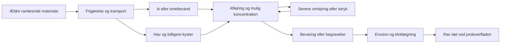

# Jordrav i Danmark: geologisk potentiale og grundlag for et landsdækkende kort

> Historisk kortstatus: denne rapport blev udført med model 0.1.
> Nationale farver og klasseregler er siden revideret i
> [model 0.2](JORDRAV_NATIONAL_MODEL_0_2.md). Rapportens kildeobservationer
> bevares; udsagn om frosne regler, guide-only levering og åbne nationale
> farveændringer er supersederet. Gamle regelbundne audits reproduceres
> fra commit eee7b08e.

**Dato:** 4. oktober 2026. **Status:** Faglig analyse med efterfølgende lokal [kortprototype 0.1](JORDRAV_PROTOTYPE_0_1.md); ikke publiceret. Analysebaseline er RavRadar 4.0.541, commit `bbc3c79fe555dffbff4a88af8cdf54573953efdb`. Prototypens faktiske regler og kontroller beskrives særskilt; denne rapports oprindelige anbefalinger er ikke alle implementeret.

**Fortsat regional analyse:** [Fire regionale sedimentkæder](JORDRAV_REGIONALE_KAEDER_2026-10-04.md) uddyber Rubjerg–Lønstrup, Gribskov–Allerød, Stenstrup–Kirkebysand og Varde bakkeø. Kortet har nu en regional guide og fokus på forhøjet procespotentiale; regional tekst giver ikke en automatisk klassebonus.

**Ny dybde- og fundbarhedsanalyse:** [Fra sedimenttransport til markfund](JORDRAV_TRANSPORT_PLOEJELAG_2026-10-04.md) forbinder ravets fysiske transport og bevaring med pløjning og regn. GEUS' øvre jordartssymbol er en geologisk aflejring, ikke en analyse af pløjelaget. Den nye diagnose af alle udsnit viser, hvilke mulige miljøer det snævre fokus skjuler. Vendsyssels tidligere havmiljøer er tilføjet som femte regional case; kortklasser og data er uændrede.

## Konklusion og konkret anbefaling

Danmark har et brugbart grundlag for et **kort over geologisk jordravpotentiale**, som kan pege på muligheder uden for allerede kendte fundsteder. Den mest lovende tilgang er at følge ravets mulige vej gennem ældre sedimenter, istransport, smeltevand, gentagen omlejring og senere blotlægning. Kortet skal vurdere denne sammenhæng i virkelige geologiske områder frem for at farvelægge landet alene efter jordtype.

De første geografiske kandidater er sandaflejringer og omlejringsmiljøer i Vendsyssel, det nordlige og nordøstlige Sjælland, dele af Sydsjælland og Fyn samt erosions- og smeltevandsmiljøer ved vestjyske bakkeøer. Der er forskellige begrundelser for disse kandidater. Nogle har direkte ravspecifik støtte i litteraturen; andre er nye, geologisk begrundede muligheder. Afsnittet om geografiske kandidater adskiller dem.

Et nyttigt potentialekort kræver ikke et tidligere ravfund i hver polygon. Det må udlede muligheder fra geologien. Til gengæld skal det forklare, **hvilke led der støtter vurderingen**, og hvor meget der beror på en hypotese. Et område kan have interessant potentiale og samtidig lav sikkerhed i vurderingen. Manglende kortlægning skal behandles særskilt.

Kortet anbefales bygget som en selvstændig fane på ravradar.dk med to valgbare baggrundskort: **Almindeligt kort** og **Luftfoto**. De samme gennemsigtige potentialepolygoner og forklaringer skal fungere på begge. Det nyere jordartskort får forrang; det ældre landsdækkende kort indgår efter ejerens aktuelle instruktion som supplerende grundlag i hullerne. Geologien beregnes på forhånd og indlæses først, når jordravfanen åbnes.

## Hvilket spørgsmål kortet skal besvare

Spørgsmålet er: *Hvor er de geologiske forhold forholdsvis gunstige for, at rav kan være tilført, bevaret, koncentreret og kommet tæt nok på jordoverfladen til at være relevant for markrav?*

Det er et andet spørgsmål end, hvor rav oprindeligt blev dannet, hvor en boring har fundet rav i stor dybde, eller hvor der er gode strandforhold i dag. Disse oplysninger kan støtte forskellige led i analysen, men må ikke blandes til én uspecificeret vurdering.

Der bør derfor være tre adskilte oplysninger ved klik:

1. **Geologisk potentiale:** Den samlede, kvalitative vurdering af mulighederne.
2. **Sikkerhed i vurderingen:** Styrken, aktualiteten og den geografiske præcision af grundlaget.
3. **Nærhed til overfladen:** Hvad der faktisk vides eller antages om dæklag og blotlægning.

Adgang til arealet og dagens dyrkning eller vegetation er yderligere forhold. Et luftfoto giver kontekst, men kan ikke påvise rav under jorden eller garantere, at en mark er tilgængelig i dag.

## Den geologiske kæde

Dette er en årsagsmodel, ikke en påstand om, at alle ravstykker har gennemløbet samtlige led. Et ravstykke kan f.eks. være aflejret marint, senere optaget i glaciale sedimenter og til sidst transporteret af smeltevand. Et andet kan indgå i en stor sedimentflage, som isen har flyttet relativt samlet.

Hvert led kan både forbedre og forringe mulighederne. Transport kan føre rav til et område, men også sprede det. Erosion kan blotlægge en koncentration, men også fjerne den. Ny aflejring kan koncentrere rav i et lille lag eller begrave det under en stor sedimentmægtighed. Derfor anbefales en model med sammenhængende processer og betingelser frem for en sum af generelle pluspoint.

## Ravets oprindelse og ældre lagre

Hypotesen om nordlige eller skandinaviske kilder og efterfølgende havtransport er relevant. Den bør dog behandles som en mulig kildehistorie, hvis betydning kan variere mellem aflejringer og landsdele. En nyere originalartikel om dansk rav fremhæver, at de ravførende sedimentkilder til dansk kystrav endnu ikke er sikkert identificeret. Den diskuterer Larssons hypotese om sydsvenske eocæne kilder og senere omlejring til miocæne aflejringer i Jylland. Det er støtte til at undersøge en sådan kæde, ikke bevis for én fælles oprindelse til alt dansk jordrav. [Drohojowska m.fl. 2024, afsnittet Geological setting, s. 650](https://www.app.pan.pl/archive/published/app69/app011732024.pdf).

Et kort over en antaget gammel ravskov kan derfor være baggrundsviden om mulig tilførsel. Det er ikke i sig selv et nutidigt potentialekort. For at føre skovhypotesen videre skal der være en plausibel sedimentvej til danske aflejringer og en efterfølgende historie, der kan bringe materialet nær overfladen.

Miocænt glimmersand og brunkulsholdige sedimenter er relevante som **mulige fødesedimenter** i nogle modeller. Det betyder ikke, at alle brunkulsområder skal have forhøjet potentiale. Organisk materiale kan stamme fra mange forskellige aldre og kilder, og en aflejring kan være ravfattig, selv om den indeholder rigeligt træ og kul.

## Isens rolle: transport, flager og istryk

Isen kan påvirke mulighederne på mindst tre forskellige måder:

| Proces | Mulig betydning for jordrav | Hvad kortanalysen skal undersøge |
|---|---|---|
| Optagelse og blanding i till | Rav kan spredes i en moræne sammen med andet ældre materiale | Tilførsel, proveniens og hvilke sedimenter isen faktisk har eroderet |
| Flytning af sedimentflager | En ravførende sandaflejring kan bevare noget af sin interne struktur under transport | Sandflager, stratigrafi, deformation og deres placering i dæklagene |
| Glaciotektonisk opskydning | Ældre lag kan flyttes opad, gentages eller stilles stejlt | Dokumenterede thrustkomplekser og ravrelevante lag i dem |

De processer gør morænelandskaber interessante, selv hvor der ikke er kendte markfund. Men en randmoræne er et tegn på isdynamik, ikke i sig selv et tegn på ravtilførsel. Den giver mest støtte, når den kan forbindes med relevante sedimenter og en rimelig blotlægningshistorie.

Høyer m.fl. dokumenterer ved Varde bakkeø en dybtgående deformation af miocæne og mellempleistocæne lag samt flere erosions- og opskydningsfaser. Det viser, at gentagen geologisk omlejring i Danmark er en reel proces. Studiet undersøger ikke rav; ravpotentialet i sådanne miljøer er derfor en videre slutning, som kræver vurdering af de berørte sedimenter. Her er den verificerede originalartikels abstract anvendt, ikke en gennemgang af hele artiklens geofysiske materiale. [Høyer m.fl. 2013](https://pub.geus.dk/da/publications/deeply-rooted-glaciotectonism-in-western-denmark-geological-compo/).

### Flere istider skal forstås som en rækkefølge

Et geografisk overlap mellem gamle isrande er ikke en samtidig ravfælde. En relevant hypotese er i stedet:

1. En tidlig proces tilfører rav til et sedimentlager.
2. Et senere isfremstød optager eller opskyder noget af lageret.
3. Smeltevand sorterer og genaflejrer dele af materialet.
4. En yngre proces blotlægger eller begraver den nye aflejring.

En senere is kan også have fjernet hele det tidligere lager. Derfor må gentagen omlejring ikke få et automatisk bonuspoint. Den skal beskrives med et muligt fødesediment, en transportretning, en yngre modtageraflejring og en kronologisk relation. Hvor rækkefølgen er ukendt, kan området stadig være en geologisk kandidat, men sikkerheden i netop dette argument er lav.

Den officielle nordiske israndsfil er et oversigtskort over sidste afsmeltning, ikke et komplet digitalt kort over Elster-, Saale- og Weichselhistorien. Sådanne ældre hændelser skal suppleres fra regional stratigrafi og faglitteratur. [GEUS: Israndslinier og Isafsmeltning i Norden](https://doi.org/10.22008/FK2/XOOWSR).

## Smeltevand og koncentration

Smeltevand kan udvaske rav fra ældre sedimenter og genaflejre det i sandlag, kanaler, bassiner eller andre sedimentære miljøer. Den ravspecifikke danske støtte er især **ravpindelag**: lag med rav sammen med omlejret organisk materiale.

Pedersens analyse af Rubjerg Knude beskriver ravpindelag i Rubjerg Knude Formationen, der fortolkes som smeltevandsaflejringer påvirket af glaciotektonik. Formationen kan spores i boringer omtrent 10 km ind i landet. Det er stærk støtte til forbindelsen mellem rav, smeltevand og istryk. Formationsudbredelsen er dog ikke en kortlagt ravkoncentration, og den omtalte afstand må ikke omdannes til en cirkulær potentialezone. [Pedersen 2005, s. 46 og 48](https://www.geus.dk/media/13810/nr8_p001-192.pdf).

Vores videre geologiske slutning er at lede efter forhold, som kan have gentaget dele af denne proces: tilgængelige ældre sedimenter, sandede modtageraflejringer, sedimentære fælder og senere erosion. Det kan også udpege områder uden kendte ravfund.

Det er ikke fagligt begrundet at rangere alt groft smeltevandsgrus over alt fint sand. Ravets hydrauliske opførsel afhænger også af størrelse, form og densitet. Historiske beskrivelser viser desuden rav i både sandlag og yngre finkornede aflejringer. Jordartskoden skal derfor bruges som miljøinformation, ikke som en universel koncentrationsregel.

## Tidligere havområder og kyster

Havtransport og kystomlejring kan have genoptaget rav fra ældre aflejringer. Hævede marine flader, gamle kystskrænter og strandvoldssystemer er derfor relevante kandidater, især hvor de kan forbindes med mulige ravførende fødesedimenter.

Bennike og Jensen fandt i deres undersøgte sedimenter fra den sydvestlige Østersø bl.a. små ravfragmenter sammen med gammelt, omlejret organisk materiale. Deres diskussion af dateringsproblemer viser også, hvorfor ravets dannelsesalder ikke må forveksles med aflejringens alder. Dette støtter marine omlejringsprocesser; det fastlægger ikke danske markravzoner. [Bennike & Jensen 1998, s. 31](https://2dgf.dk/xpdf/bull45-1-27-38.pdf).

Gamle kyster kan ikke tegnes som én fælles højdekurve for hele Danmark. Lokal landhævning og havniveauhistorie har været forskellige. Daterede regionale kystforløb, marine sedimenter og geomorfologi er et bedre grundlag. [Christensen & Nielsen 2008](https://pub.geus.dk/en/publications/dating-littorina-sea-shore-levels-in-denmark-on-the-basis-of-data/).

Kortmæssigt bør en strandvold eller marint sand give støtte til en mulig sorterings- og aflejringsproces. Støtten bliver stærkere, når der også findes en plausibel ravtilførsel og begrænset yngre overlejring. En marin flade under et tykt dæklag kan være relevant som lager, men mindre direkte relevant for markrav ved overfladen.

## Danske ravspor og geografiske muligheder

Nedenstående er en **begrundet shortlist til potentialemodellen**, ikke færdige polygonafgrænsninger. Prioriteten gælder den geologiske analyse og den mulige relevans for jordrav. Den er ikke en målt rangliste over fundhyppighed.

| Geografisk kandidat | Støtte og mulig ravhistorie | Hvor analysen bør lede efter nye muligheder |
|---|---|---|
| Vendsyssel: Rubjerg–Lønstrup og beslægtede indlandsaflejringer | Moderne ravspecifik støtte til smeltevand og glaciotektonik; historiske ravførende boreprøver også ved Hjørring og Hvilshøj | Relevante sandenheder, deres erosionsrande og kontakter med yngre marine eller glaciale aflejringer |
| Nordøstsjælland: Ordrup–Gentofte–Vangede, Nivå–Espergærde og nordlige sandmiljøer | Historiske beskrivelser af ravpindelag; regional GEUS-stratigrafi beskriver ravpindelag mellem yngre glaciale enheder | Sandaflejringer og sandflager med beslægtet stratigrafi; områder hvor erosion eller tynde dæklag kan bringe dem nær overfladen |
| København–Valby–Frederiksberg | Rav i sandlegemer og flager i moræner er historisk veldokumenteret | Bruges især til at forstå processen og beslægtede geologiske miljøer; nutidig bebyggelse og dæklag begrænser direkte markrelevans |
| Sydsjælland omkring Næstved | Original ekskursionsbeskrivelse omtaler ravpindelag i sandpartier i den nederste af to morænebænke | Kontakter mellem ældre sand, moræner og efterfølgende erosion; nærliggende smeltevandsformer er kandidater, ikke automatisk ravførende |
| Sydfyn omkring Stenstrup og beslægtede issømiljøer | Hartz beskriver omlejret rav i senglacialt ler ved Stenstrup | Bassinrande og yngre aflejringer med en mulig forbindelse til erosion af ældre ravholdigt materiale |
| Nordsjælland: Allerød og beslægtede yngre bassinmiljøer | Historiske beskrivelser af rav sammen med omlejrede planterester i yngre ferskvandsaflejringer | Genaflejringsmiljøer nedstrøms relevante ældre sandlag, frem for kun selve morænebakkerne |
| Vestjyske bakkeøer og tilstødende erosions-/smeltevandsområder | Stærk støtte til kompleks omlejring; ravspecifik støtte mere ujævn | Kontakter mellem ældre sedimenter, eroderede bakkeøer og yngre modtageraflejringer; vurderes som mekanismebaseret mulighed |
| Bovbjerg og beslægtede vestjyske glaciale sandmiljøer | Historisk ravspecifik lagbeskrivelse, men også stor lokal variation i ravindhold | Beslægtet stratigrafi inde i landet; en kysteksponering bruges til at lære om lageret, ikke som automatisk indlandsbuffer |
| Hævede eller tørlagte marine områder med relevante fødesedimenter | Plausibel hav- og kystomlejring; grundlaget varierer regionalt | Gamle strandvolde, kystkontakter og sandede aflejringer, hvor tilførsel og yngre dæklag kan vurderes |

De historiske lokaliteter og forskellen mellem direkte ravbeskrivelser og lignende organisk materiale er gennemgået i Hartz' originalværk, især s. 91–107. Næstvedbeskrivelsen er læst i originalen fra 1936, s. 108. Den regionale nordsjællandske stratigrafi er læst i DGU-kortserie nr. 15, PDF-side 6. [Hartz 1909](https://archive.org/details/bidragtildanmark00hart), [DGF 1936](https://2dgf.dk/xpdf/bull-1936-9-1-103-109.pdf), [DGU kortserie nr. 15](https://data.geus.dk/pure-pdf/DGU_KORT_SERIE_NR_15.pdf).

### Hvad de gamle beskrivelser bidrager med

Hartz' materiale giver mere end en liste over steder: Det beskriver rav i flere forskellige værtsmiljøer og senere genaflejring. Særligt Stenstrup og Allerød gør det relevant at undersøge yngre bassinaflejringer, som har modtaget materiale fra ældre lag. Det udvider modellen fra “sand og moræner” til en faktisk transportkæde. Det centrale afsnit på trykt side 107 er desuden visuelt kontrolleret mod originalscanningen, ikke kun læst som OCR.

Kildekritikken har betydning for den geografiske vurdering. Nogle oplysninger er Hartz' egne undersøgelser; andre er indberetninger, breve eller tidligere publikationer. Glesborg omtales eksempelvis med ravlignende materiale, mens andre steder kun beskrives med kul og træ. Sådanne oplysninger må ikke få samme ravspecifikke sikkerhed. Historiske sandgrave og udgravninger er desuden skævt fordelt efter, hvor man kunne se lagene. Færre beskrivelser fra en landsdel betyder derfor ikke automatisk ringere potentiale.

Historiske dateringer og betegnelsen “Diluvialsand” omsættes ikke direkte til en bestemt moderne formation eller istid. En nutidig afgrænsning kræver stratigrafisk sammenhold. Det er stadig muligt at bruge den historisk beskrevne proces som støtte til en ny potentialehypotese.

## Forslag til en kvalitativ potentialemodel

### Regional efterprøvning: Nordøstsjælland

Houmark-Nielsens nyere regionale gennemgang beskriver flere generationer af åse og smeltevandslandskaber. På trykt s. 81 omtales forskellige afløbssystemer mod nordvest og en åben forbindelse mellem Hillerødåsene og én eller flere isstrømme. Ved Multebjerg viser profilet på s. 67–68 en rækkefølge fra ældre sand/grus og moræner til yngre erosion, flodaflejring og søsedimenter. Det giver en konkret regional proceshistorie; artiklen påviser ikke rav i disse aflejringer. [Houmark-Nielsen 2024, s. 67–68 og 81](https://2dgf.dk/xpdf/gt2024-32-106..pdf).

**Vores videre slutning** er, at nye muligheder bør undersøges langs sammenhængende erosions- og modtagerforløb. Det gør Gribskovs sand-/grusmiljøer, åssystemer og beslægtede bassinrande til fagligt relevante kandidater uden et allerede registreret ravfund. Profilhistorien giver dog ikke én fælles alder eller tilførsel til samtlige sandpolygoner. Kulholdige blokke, et morænelag og et yngre bassin er hver for sig utilstrækkelige til at forbinde kæden.

En stærkere efterfølgende model kan skelne mellem tre situationer: et ældre muligt lager, en yngre erosions-/transportenhed og et modtagerlag. Først når den regionale relation er undersøgt, kan den generelle sand-plus-procesklasse prioriteres yderligere. For prototypen er dette en efterprøvningsramme, ikke et nyt nationalt bonuslag.

### Følsomhed og konkurrerende forklaringer

Et robust resultat bør bevare muligheder, som stadig er plausible under flere kildehistorier. Nedenstående scenarier er vores analyse af modellens følsomhed, ikke nye fundoplysninger eller målte sandsynligheder.

| Kandidattype | Hvis rav kommer med ældre glaciale sandpakker | Hvis lokal tilførsel hovedsagelig er marin | Hvis yngre dæklag er vigtigst for markrelevansen |
|---|---|---|---|
| Smeltevandssand i erosionsdal | Interessant, hvis erosion kan forbindes med et ældre lager | Afhænger af forbindelsen til marine fødesedimenter | Den overfladekortlagte sandenhed er mere direkte relevant end et dybt sandlag |
| Sandet strandvold | Kan modtage rav frigjort fra glaciale aflejringer | Gentagen bølgeomlejring er en relevant mulig koncentrationsproces | Flyvesand, tørv og nyere fyld kan flytte eller dække det relevante lag |
| Yngre ferskvandsbassin | Kan modtage omlejret materiale fra oplandet; ler er ikke en automatisk udelukkelse | Kræver en ældre marin forbindelse eller senere erosion af marine lag | Et ravrelevant dybt bassinlag kan være bevaret, men svagt relevant ved markoverfladen |
| Moræne-/bakkeømiljø | Flyttede flager og erosionskontakter er mulige, men till alene prioriterer svagt | En marine-glacial kæde kræver stratigrafisk støtte | Lagdeling og senere erosion bliver afgørende; kortets overfladefelt alene beskriver ikke hele pakken |

Denne sammenligning giver en konkret arbejdende prioritet: begynd med vurderbare, overfladenære modtagermiljøer og undersøg derfra deres mulige fødesedimenter. Et område med svag ravsikkerhed kan stadig være interessant, når flere plausible kæder mødes. Uenighed mellem kæderne skal beskrives i forklaringen frem for skjules i en gennemsnitlig score.

Følsomheden ved materialekoder er også vigtig. En grov ældre samlekategori kan blande sand og ler; en yngre overflade-/dybdeforskel kan ændre markrelevansen; en landskabskode kan dække flere betegnelser. Den første prototype holder sådanne forskelle synlige. Den har endnu ikke valideret regional sedimentforbindelse eller rangorden mod uafhængige feltdata.

Den første model bør give **relative, geologisk begrundede potentialeklasser**. Den bør ikke foregive kalibrerede fundprocenter eller en præcis forventet ravmængde.

For hver polygon vurderes følgende led:

| Led | Positiv støtte | Svækkelse eller åben usikkerhed |
|---|---|---|
| Tilførsel | Ravspecifik regional litteratur eller plausibel forbindelse til relevante ældre sedimenter | Kildehistorien er ukendt eller transportforbindelsen mangler |
| Transport | Regionalt begrundet is-, smeltevands- eller havtransport | Kun nærhed til en isrand eller nutidig kyst |
| Modtagelse og koncentration | Relevant sedimentært miljø, sandlag, bassin eller omlejringskontakt | Stor ensartet jordart uden oplysninger om sedimentær struktur |
| Bevaring | Laget kan være bevaret gennem yngre hændelser | Senere erosion kan have fjernet eller stærkt spredt materialet |
| Nærhed til overfladen | Relevant overfladenær jordart, erosion eller begrænset dæklag | Kun et dybt ravspor eller ukendt overlejring |

En vurdering kan godt bygge på indirekte geologisk støtte i flere led. Et direkte fund er **ikke et obligatorisk adgangskrav** til forhøjet potentiale. Det direkte fund styrker ravspecifik sikkerhed, mens sammenhængende geologi kan skabe en interessant kandidat andre steder.

### Klasser, der kan forstås på kortet

- **Forhøjet geologisk potentiale:** Flere led i en sammenhængende mulig ravhistorie har støtte, og der er en rimelig forbindelse til overfladenære sedimenter. Klassen er en faglig vurdering, ikke en fundgaranti.
- **Muligt geologisk potentiale:** Transport- og aflejringsmiljøet er relevant, men tilførsel, koncentration eller overfladenærhed er svagere belyst.
- **Begrænset geologisk potentiale:** Den tilgængelige geologi taler konkret imod en relevant overfladenær sedimentkæde. Klassen må ikke tildeles blot på grund af manglende fund eller få kilder.
- **Uafklaret:** Geologisk datamangel, uafklaret kildekonflikt eller et område, som ikke kan vurderes med den valgte model.

Sikkerheden angives separat som stærkere, middel eller svag og forklares ved klik. Den skal rumme både kortets geografiske grundlag og ravslutningens styrke. Et præcist jordartskort gør ikke i sig selv ravhypotesen sikker. En dokumenteret dyb aflejring kan omvendt være sikkert kendt, mens dens relevans for markrav er uafklaret.

De konkrete klasseregler skal skrives som gennemgåelige beslutningsregler før første kortbygning. Der bør ikke indføres vilkårlige vægte som “moræne +20, smeltevand +30”. Flere kort, der bygger på samme oprindelige feltkortlægning, er heller ikke flere uafhængige beviser.

### Eksempler på modeladfærd

| Situation | Anbefalet fortolkning |
|---|---|
| Smeltevandssand i et begrundet regionalt tilførsels- og omlejringsmiljø, tæt ved overfladen | Kandidat til forhøjet potentiale; ravslutningens sikkerhed afhænger af den regionale støtte |
| Samme jordart langt fra en identificeret sedimentkæde | Muligt potentiale med svagere begrundelse; jordart alene udløser ikke højeste klasse |
| Ravspor i dyb boring under flere dæklag | Positiv støtte til lager/tilførsel; overfladerelevansen vurderes separat |
| To isrande overlapper på et oversigtskort | Ingen automatisk ændring; vurder en mulig kronologisk omlejring |
| Hævet marint sand og en relevant gammel kystkontakt | Mulig koncentrationsmekanisme; stærkere vurdering kræver også tilførsel og overfladerelevans |
| Tynde yngre aflejringer oven på en plausibel ravholdig enhed | Undersøg erosion og genaflejring; dæklaget er ikke automatisk en negativ faktor |
| Fyldjord, by eller råstofgrav som eneste jordartskategori | Ikke vurderbar som naturlig sedimentkæde fra denne kategori alene |

## Verificerede offentlige geodata

Originalarkiverne er downloadet til systemets temp-mappe og kontrolleret mod GEUS' publicerede MD5-identiteter. Shapefilerne er læst direkte. Resultater, SHA-256-identiteter, felter og klassifikationer er gemt i [det reproducerbare auditresultat](jordrav/public-geodata-audit-2026-10-04.json). Original geometri er ikke lagt ind i RavRadars produktionsdata.

| Datagrundlag | Verificeret anvendelse og væsentlig begrænsning |
|---|---|
| [Jordartskort 1:25.000, v7.1/2026](https://doi.org/10.22008/FK2/SQI9ZB) | Primært overfladenært materialegrundlag. GEUS angiver 93,2 % af landarealet kortlagt. CC BY 4.0. Jordartsgrænser kan være forskudt 50–100 m; kortets målestok er ikke matrikelpræcision. |
| [Jordartskort 1:200.000, v2/2011](https://doi.org/10.22008/FK2/AAEEMN) | Supplerende landsdækkende grundlag efter ejerens aktuelle instruktion. Grovere og delvis fortolket; generelt op til omkring 200 m grænseusikkerhed. Har egne GEUS-vilkår, som ikke omklassificeres til CC BY. |
| [Geomorfologisk kort, v3/2022](https://doi.org/10.22008/FK2/0U6ERA) | Landsdækkende landskabs- og procesgrundlag i 1:200.000, CC0. Terrænstribning er ikke fuldt kortlagt nord for Horsens; det betyder ikke, at hele Jyllands landskabskort mangler. |
| [Nordiske isrande](https://doi.org/10.22008/FK2/XOOWSR) | Regional kontekst i 1:1 mio., CC0. Sidste afsmeltning med faktiske og hypotetiske linjer; ikke en selvstændig rav- eller fleristidsmodel. |

### Hvad selve filerne viser

| Lag | Poster | Koordinatpunkter | Ugyldige geometrier efter GEOS-kontrol |
|---|---:|---:|---:|
| Geomorfologiske polygoner | 15.178 | 1.593.117 | 0 |
| Nyere jordartspolygoner | 199.653 | 11.266.996 | 438 |
| Ældre jordartspolygoner | 24.192 | 1.524.398 | 47 |
| Israndslinjer | 429 | 9.007 | 0, men én tom kildegeometri |

Dette er egne målinger af de konkrete filer. Ugyldighed efter en geometri-validator er ikke i sig selv en forkert geologisk jordartsbestemmelse. Det kræver dog en kontrolleret behandling før skæring og sammenlægning af polygoner. Kilderne må ikke stiltiende “repareres” og bagefter beskrives som uændrede originaler.

Den målrettede opfølgning finder ring-selvskæringer i alle de ugyldige jordartspolygoner. Et diagnostisk `make_valid`-forsøg giver gyldige polygoner i alle tilfælde, heraf to flerpolygoner i det nyere kort, og kun numeriske arealforskelle under én kvadratmeter pr. kildepost. Det gør en kontrolleret normalisering realistisk. Forsøget gemmer ikke nye geometrier og erstatter ikke kontrollen af fælles grænser i en fremtidig kortbygning.

Det nyere kort har særskilte felter `jsym1`, `jsym2` og `tsym`. GEUS' ledsagende informations-PDF beskriver de første som jordart ved overfladen og omkring én meters dybde, mens `tsym` er den fortolkede visningskategori. **20.539 polygonposter har forskellig `jsym1` og `jsym2`**. Derfor skal modellen bevare dybdeforskellen i stedet for blot at læse farvekoden som et ensartet overfladelag. [GEUS' informations-PDF, 2026](https://dataverse.geus.dk/api/access/datafile/100404).

Det ældre kort har 37 forekommende `TSYM`-kategorier i den konkrete fil. Det omfatter 11 kvartære hovedgrupper samt prækvartære bjergarter, sø og fyld. Det må derfor ikke reduceres til “12 ens jordtyper”, og dets samlekoder, f.eks. `DSG`, skal oversættes med den korrekte legenderegel. [GEUS' beskrivelse, 2011](https://dataverse.geus.dk/api/access/datafile/43292).

Der er også en afstemningsopgave: Produktbeskrivelsen for det nyere kort omtaler 82 jordarter, mens filauditen finder 81 forekommende kombinationer af symbol, jordart og tidsalder. Det er en tælle-/legendeforskel, der skal afklares før en udtømmende klasseregel publiceres; ikke en anledning til at opfinde den manglende kategori.

Den geomorfologiske fil har 36 kombinationer af kode og landskabsbetegnelse. En kode er ikke altid en entydig kategori: Kode 50 optræder både med hævet senglacial flade og hævet senglacial strandvold. Samme betegnelse kan også have forskellige koder. Modellen skal derfor læse de relevante felter og versionen samlet.

Israndslinjerne har `TYPE` og `Version`, men ingen færdige hændelsesaldre pr. linje. Filernes versionsfelt er 1995; deponering og rapportudgivelse er senere. Den ledsagende legendes afsmeltningsintervaller og de hypotetiske linjer skal kobles korrekt, før de kan bruges i en tidslig forklaring. Interne ID'er er ikke aldre.

### Sådan kombineres de to jordartskort

Det nyere kort skal anvendes i dets faktisk kortlagte områder. Det ældre kort skæres til de resterende områder og leverer et **groft supplerende jordartsgrundlag**. Det ældre korts fulde dækning giver ikke automatisk fuld ravviden eller samme sikkerhed overalt.

En vigtig praktisk detalje er, at det nyere lag også indeholder **1.154 polygoner med `X` — ukendt lag/oplysninger mangler**. En eksisterende polygon er altså ikke nødvendigvis kortlagt jordart. En simpel test af, om det nyere lag har geometri på stedet, ville fejlagtigt kunne blokere det ældre supplement. Grundlaget skal vælges efter både geometri og kategori: anvend nyere materialebestemmelser, og brug det ældre kort i de relevante uklassificerede områder med synlig kildeangivelse. By, fyld, råstofgrav og andre særlige kategorier kræver deres egen regel; de skal ikke automatisk erstattes af en historisk naturlig jordart.

Hver afledt polygon skal bevare kilde, produktversion, målestok, anvendte felter og en markering af supplerende grundlag. Modstridende kortkategorier undersøges; de udglattes ikke til et gennemsnit. Et gammelt hovedgruppe-symbol kan ikke udfylde en nyere detaljeret kategori, som om den var målt.

Ejerens aktuelle beslutning om at bruge det ældre kort erstatter analysens tidligere forslag om at udelade de downloadede polygoner som supplement. Den ændrer ikke den verificerede kildeangivelse eller selve GEUS' vilkår. Denne analyse har hentet og undersøgt kortet; publicering er endnu ikke udført.

## Almindeligt kort og luftfoto

Det er et fast produktkrav, at brugeren kan skifte mellem **Almindeligt kort** og **Luftfoto**, mens potentialelag, valgt område, zoom og forklaring bevares. Baggrundene er valgbare basekort; de behøver ikke hentes samtidigt. Potentialelagets gennemsigtighed kan justeres, så landskabet kan aflæses på begge baggrunde.

RavRadar bruger allerede Leaflet 1.9.4 og har i `createMap()` OpenStreetMap og Esri World Imagery som basekort. Det gør genbrug af kortfunktioner realistisk. Det nye jordravkort skal have egen kortinstans og eget lagindhold. Korttilstand og den eksisterende kystkortfunktion må ikke utilsigtet blandes.

En officiel dansk luftfotomulighed er **GeoDanmark Ortofoto forår Web Mercator WMTS**. Den dokumenterede tjeneste bruger EPSG:3857 og matrixsættet `DFD_GoogleMapsCompatible`, som passer til Leaflets almindelige kortprojektion. Den officielle side angiver senest 2025-billeder og API-key/OAuth-adgang. Dette er dokumenteret tjenestekompatibilitet; en live tile med RavRadars egen adgang er ikke testet. [Datafordeler: Web Mercator WMTS](https://datafordeler.dk/dataoversigt/geodanmark-ortofoto/ortofoto-foraar-web-mercator-wmts/).

GeoDanmark Ortofoto er omfattet af de officielle CC BY 4.0-vilkår for KDS' frie geografiske data. Kortet skal kreditere dataleverandøren korrekt. [Datafordeler: anvendelsesvilkår](https://datafordeler.dk/vejledning/brugervilkaar/kds-geografiske-data/).

Før valg af endelig tjeneste skal browseradgang og tilladte domæner afklares. En serverhemmelighed må ikke lægges i JavaScript; eventuel direkte browseradgang kræver en adgangsform beregnet til det. Den nuværende CSP tillader ikke den nye WMTS-vært, så en afgrænset ændring bliver nødvendig, hvis den tjeneste vælges. Der er ikke oprettet en konto, købt en tjeneste eller ændret nøgler i denne analyse.

Esris nuværende World Imagery kan undersøges som genbrugsmulighed. Dets aktuelle item henviser til Esris aftalevilkår og begrænser bl.a. offline-eksport; en offentlig tileadresse beviser ikke ubegrænset anvendelse. [World Imagery](https://www.arcgis.com/home/item.html?id=10df2279f9684e4a9f6a7f08febac2a9), [Esris aktuelle vilkårsoversigt](https://goto.arcgis.com/termsofuse/viewsummary).

Den anbefalede rækkefølge er at undersøge direkte, egnet adgang til det officielle danske luftfoto og derefter beslutte, om eksisterende World Imagery skal genbruges. Produktkravet om de to baggrunde står fast uanset leverandørvalget. Der indføres ikke en ny serverpipeline alene for at vise baggrundskort.

## Visuelt og praktisk kortdesign

Kortet bør være let at bruge fra begyndelsen:

- Et Danmarksoverblik med tydelig signaturforklaring, også for uafklarede områder.
- Gennemsigtige potentialefarver, som er læselige på både et lyst kort og luftfoto.
- En særskilt visning af usikkerhed, f.eks. diskret skravering eller kantmarkering, med forklaring i signaturen. Svag sikkerhed må ikke ligne lavt potentiale.
- Klik på en polygon åbner et fast panel med potentiale, begrundelse, overfladerelevans, kilder og vigtigste usikkerhed.
- Mulighed for at vise jordart og geomorfologi som forklarende lag. Lagene skal være navngivet efter deres indhold.
- Et permanent “foreløbig geologisk model”-mærke på den første prototype.

En polygonforklaring kan f.eks. sige: “Her ligger sandede smeltevandsaflejringer i et miljø, hvor ældre sedimenter kan være blevet omlejret. Det giver en geologisk mulighed for rav. Tilførslen er indirekte begrundet, og lokal koncentration er ikke kortlagt.” Hvis den regionale støtte er stærkere, skal forklaringen beskrive hvorfor i stedet for blot at skifte farve.

Kortgrænserne er generaliserede geologiske grænser. Brugeren må gerne zoome ind på luftfoto, men teksten skal bevare den reelle geologiske opløsning. Tæt zoom giver ikke ny viden om, hvilken side af et hegn rav ligger på. Gamle lokalitetsnavne eller formationsbeskrivelser omsættes ikke til konstruerede hotspotcirkler.

Fanen bør implementeres med tastaturbetjening og korrekt fokus. Leaflet skal opdateres, når fanen bliver synlig, så et kort oprettet i et skjult element ikke får forkert størrelse. DA/DE/EN, mobilpanel og attribution indgår i den normale brugerflade.

## Datamængde, ydeevne og udgifter

De fulde GIS-filer skal ikke sendes til hver besøgende. Det nyere jordartskorts QGIS-arkiv er **112.786.637 bytes**, og selve polygon-shapefilen er omkring 378 MB før tilhørende attributter. Filauditen finder over 11 mio. koordinatpunkter. Det kræver forbehandling og en opdeling efter visningsniveau eller geografiske udsnit.

Der er udført et nationalt payloadforsøg på alle 15.178 geomorfologiske polygoner. Det bruger WGS84 med fem decimaler og få egenskaber pr. feature. Tallene nedenfor er egne målte filstørrelser, ikke browsermålinger:

| Forenkling i kildens meterprojektion | Koordinatpunkter | GeoJSON | gzip |
|---|---:|---:|---:|
| 0 m | 1.593.117 | 32.625.248 bytes | 8.694.748 bytes |
| 25 m | 561.658 | 12.890.326 bytes | 3.435.645 bytes |
| 50 m | 387.567 | 9.547.148 bytes | 2.449.100 bytes |
| 100 m | 262.777 | 7.153.814 bytes | 1.718.178 bytes |

Forsøget viser, at en landsdækkende oversigt kan gøres langt lettere. Det fastlægger ikke en godkendt forenklingstolerance. Selv forenkling med bevaret topologi **pr. polygon** kan give sprækker eller overlap mellem naboer. En publicerbar version skal forenkle fælles grænser samlet og kontrollere dækning, huller, småøer, indlandsøer og polygonrelationer.

Ved 100 m summerer forsøgets absolutte arealændringer pr. polygon til omkring 782 km². Det er hverken et nettoarealtab, en ravfejl eller en positionsfejlgrænse; det viser, hvorfor den mindste fil ikke automatisk er det bedste kort. Gyldighed er i forsøget kontrolleret før WGS84-afrunding; den endelige visningsgeometri skal også kontrolleres bagefter.

Den anbefalede levering er:

1. En lille, versionsbundet manifestfil ved første åbning af jordravfanen.
2. Et generaliseret Danmarksoverblik.
3. Mere detaljerede statiske udsnit ved zoom eller panorering, med en øvre grænse for aktive geometrier.
4. En fælles tabel med forklaringer og kilder, så teksten ikke gentages i hver polygon.
5. Indholdsidentitet eller versionsbinding for geometri, modelregler, forklaringer og cache.

TopoJSON, statiske GeoJSON-udsnit og eventuelt vektorflisepakker bør sammenlignes på de afledte potentialedata. En ekstra kortmotor bør kun indføres, hvis målinger på en realistisk mobil viser, at den giver en nødvendig fordel. Antal inputposter er ikke det samme som antal nødvendige visningspolygoner.

Dette kan holde jordravlaget uafhængigt af DMI og vejrscheduler: ingen vejrhentning, ingen Supabase-opslag for at beregne potentiale og ingen GIS-beregning på serveren pr. besøgende. Det giver stadig trafik- og lagerudgifter. Et koldt dataåbningsforløb på f.eks. 2 MB gange 10.000 åbninger er omkring 20 GB overført, før basekort og HTTP-overhead. Det er et regneeksempel, ikke et trafikestimat eller prisoverslag for RavRadar.

Baggrundsfliser hentes fra leverandøren for brugerens aktuelle kortudsnit. OpenStreetMaps offentlige standardtjeneste har egne brugs- og cachekrav og ingen garanti for ubegrænset trafik. Den må ikke massehentes eller indgå i en ny offlinepakke. [OSMF tilepolicy](https://operations.osmfoundation.org/policies/tiles/).

Den eksisterende service worker behandler samme-origin-filer og lader eksterne korttjenester gå uden om den. Jordravdata bør ikke føjes til den generelle precache, så almindelige kystkortbrugere automatisk downloader et Danmarkslag. Geologidataenes fejltilstand og cacheversion skal håndteres særskilt fra levende vejrdata.

## Faglig kontrol og efterfølgende prototype

Analysen giver et grundlag for at bygge en prototype. De næste kontroller skal gøre reglerne og afgrænsningerne gennemgåelige, ikke kræve en ny funddatabase:

1. Skriv den første klasseregel for tilførsel, transport, modtageraflejring og overfladerelevans, med lokale begrundelser og eksplicitte hypoteser.
2. Brug kandidatlisten til stratigrafiske sammenhold: Hvilke af dagens kortenheder kan faktisk knyttes til den beskrevne proces?
3. Sammenhold forskellige kildehistorier. En vurdering, der kun bliver interessant under én svag oprindelseshypotese, skal have lavere sikkerhed.
4. Kontrollér kronologien i argumenter om gentagen omlejring. Afsmeltningslinjer alene udfylder ikke denne opgave.
5. Normalisér kildegeometrier med en sporbar reparationslog og kontrollerede ændringer før overlayberegning.
6. Byg et lille antal virkelige, afgrænsede eksempler og sammenlign forklaringen med den regionale litteratur. Kendte ravlag kan teste begrundelsen, men ikke alene kalibrere markfund.
7. Vis de samme polygoner på begge basekort og test mobil, klik, lagkontrol, attribution, cache, manglende tiles og genåbning af fanen.

En følsomhedsanalyse bør undersøge, om potentialeklassen skifter ved rimelige alternative fortolkninger af kildehistorie, dæklag og grænseforløb. Det kan give et nyttigt usikkerhedslag uden brugerindberetninger. Det skaber ikke empirisk kalibrerede fundprocenter.

Modellen skal specifikt kontrolleres for: automatisk israndsbonus, automatisk brunkulsbonus, automatisk strandvoldsbonus, dobbeltregning af samme feltkortlægning, kildehuller fortolket som lavt potentiale og dybe fund fortolket som overfladefund. Det er konkrete fejlkilder i den foreslåede model, ikke generelle stopkrav for forskning.

## Hvad dette arbejdsafsnit har leveret

Der er gennemført målrettet læsning af original dansk rav- og kvartærgeologisk litteratur, kontrolleret nyere datasætbeskrivelser og læst de faktiske geodatafiler. Der er opstillet en geografisk kandidatoversigt, en procesbaseret potentialemodel, et design med to baggrundskort og en statisk leveringsarkitektur. Dette er en dyb, målrettet faglig gennemgang; ikke en påstand om udtømmende systematisk litteraturdækning.

Den gentagelige geodataaudit findes i [audit_public_geodata.py](jordrav/audit_public_geodata.py). Den foretager ingen netværkskald og ændrer ingen kildedata. Den køres med `--source-dir` til en mappe med de fire verificerede arkiver og deres udpakkede filer samt `--output` til resultatfilen. Resultaterne er offentlig geodataidentitet, geometristatistik og payloadstørrelser. Det separate [resultat fra kildegyldighedsdiagnostikken](jordrav/source-validity-diagnostic-2026-10-04.json) beskriver de ugyldige offentlige polygoner; der er ikke gemt reparerede geometrier.

RDKS- og den eksisterende sikkerhedskontrakt blev kontrolleret før dokumentationsarbejdet. Faglig slutkontrol og dokumentationskontrol skal fremgå af forskningscheckpointet. Ingen produktions-/CI-verifikation af et jordravkort er påstået.

Den fulde lokale Codex-opsætning kunne ikke installere den eksisterende vejrrelaterede `eccodeslib==2.48.2.27` på Windows. Den geologiske analyse og audit er udført med fungerende Python-, geometri- og PDF-værktøjer; fejlen er ikke omgået ved at ændre vejrafhængigheder. Nationale GIS-arkiver, cache og fulde kildedokumenter ligger i temp, ikke i leverancen.

## Supplerende litteratur og videre spor

- [Houmark-Nielsen 1987: Pleistocene stratigraphy and glacial history of the central part of Denmark](https://2dgf.dk/xpdf/bull36_01-02-1-189.pdf). Relevant stratigrafisk ramme; konkrete hændelser skal læses regionalt, ikke udledes af en generel isrand.
- [Polens geologiske institut: Amber](https://www.pgi.gov.pl/en/1263-surowce/resources/rock/14078-amber.html). Eksempel på ravførende ældre sediment i glaciale flager. Anvendes som procesanalogi, ikke dansk afgrænsning.
- RavRadars eksisterende `RAV_AMBER_TRANSPORT_SYSTEMATIC_REVIEW.md` adskiller lager, transport, aflejring og fundbarhed ved kysten. Den årsagstænkning er relevant, mens dens vejr- og strandmodel ikke overføres til jordravkortet.

De generelle materiale-/procesregler er efterfølgende omsat til virkelige kildepolygoner i [prototypen](JORDRAV_PROTOTYPE_0_1.md). Den næste stærkere faglige prioritering er at koble disse flader til regionale fødesedimenter, kronologi og bevaring. Første kort kræver ikke nye ravfund for at vise interessante muligheder.
