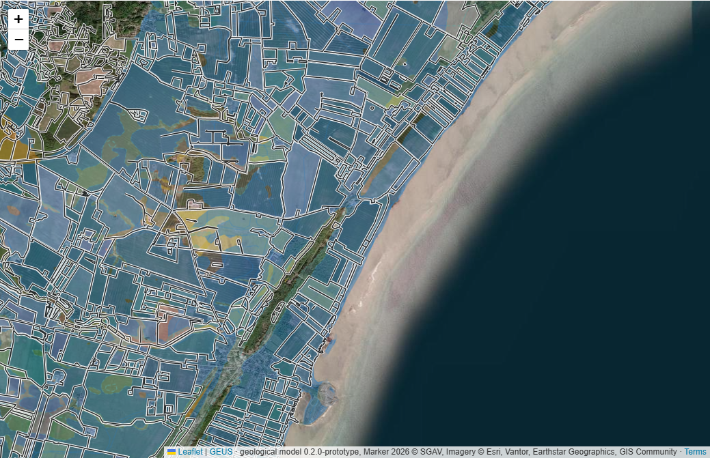
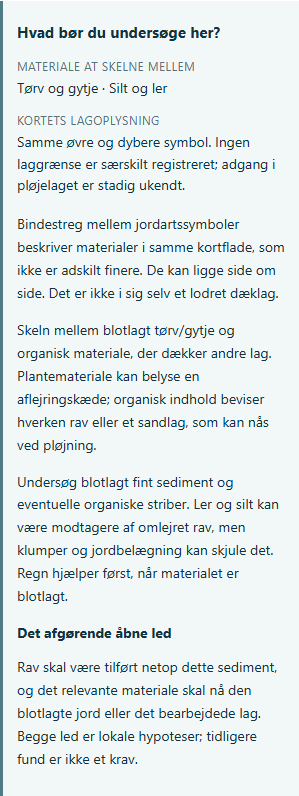

# Jordrav: materialer, lagforbindelse og landsdækkende markkontekst

Videre analyse og lokal kortforbedring 2026-10-05. Geologisk model
0.2.0-prototype, særskilt søgevejledning 0.1.0, app 4.0.541.

## Hvad der er forbedret

Ejerens seneste ordre er at analysere videre og forbedre kortet. Den
foregående nationale farvemodel er gennemgået for endnu et kritisk led:
hvordan materialet og lagbeskrivelsen kan bruges til praktisk markravsøgning.
Alle 4.652 katalogkombinationer og 505.834 detailfeatures i 192 udsnit er
undersøgt. Ingen regionsliste begrænser analysen.

Kortet har nu to konkrete tilføjelser:

- **Hvad bør du undersøge her?** ved polygonklik: en fysisk
  materialeforklaring, lagrelation, relevant søgeopgave og det afgørende
  åbne led. Den gælder også ufarvet og uafklaret geologi.
- **Markgrænser 2026 · hele Danmark**: et valgbart officielt rasterlag
  med sort/hvide omrids på almindeligt kort og luftfoto. Det indlæses kun
  ved lokal zoom. Grænserne er markregistrering, ikke ravgrænser.

Den eksisterende geologiske model og samtlige datasetbytes bevares.
Denne revision præciserer materialer og søgeforudsætninger; den tilfører
ingen fundchance, ravmængde, feltobservation eller dokumenteret pløjeadgang.

## Tre forskellige led skal mødes

Et aflejringsmiljø kan være relevant, uden at den konkrete mark har rav.
En lokal ravmulighed kræver en sammenhæng mellem tilførsel, aflejring/
bevaring og nutidig adgang. De geologiske farver belyser transport eller
modtagelse. De beviser ikke de to andre led på hver mark.

Ravpindelag og omlejring ved Rubjerg giver et ravspecifikt eksempel på,
at organiske materialer kan følge en sedimentkæde. Fine modtagere indgår
også i de historiske Stenstrup-observationer. Det underbygger, at sandets
kornstørrelse ikke er en universel regel for ravets tilstedeværelse.
[Pedersen 2005, s. 46–48](https://www.geus.dk/media/13810/nr8_p001-192.pdf),
[Hartz 1909, s. 91–107](https://archive.org/details/bidragtildanmark00hart).
Overførsel til andre danske flader er fortsat vores geologiske hypotese.
Deraf følger hverken en ensartet koncentration eller en sand/ler-rangliste.

På marken skal materialet være blotlagt eller befinde sig i det lag, der
bearbejdes. Regn kan vaske blotlagt rav rent; den åbner ikke automatisk
et underliggende sediment. Et feltomrids hjælper med at finde en relevant
markflade i landskabet, men må ikke gøre lagadgang sikker.

## National diagnose: det brede materialenavn var utilstrækkeligt

Modelgruppen `marine-fine` samler både fine mineraler, marine organiske
aflejringer og nogle variationer. Det er brugbart til en marin
modtagerhypotese, men upræcist som fysisk søgevejledning. Blå kan derfor
betyde sand, ler, tørv, gytje eller en blanding, afhængigt af originalkoden.
HP, HT og YP adskilles nu fysisk som gytje/tørv; de omdøbes ikke til sand.
Mineralsk ler/silt, organiske materialer, vekslende lag og flyvesand får
hver deres søgeopgave. Blandinger beholder alle deres delmaterialer.
Kalk/okker, moræne, ældre sedimenter og fast bjergart behandles særskilt.

Der er **166 katalogforklaringer / 3.489 detailfeatures** med marine
organiske materialer i den blå klasse. De er ikke nye ravfund eller
3.489 marker. Samme kildepolygon kan være opdelt i flere visningsfragmenter.
Resultatet viser omfanget af den tidligere brede materialesammenfatning,
ikke ravindhold eller areal.

Den fysiske kodeopdeling er kontrolleret mod originale feltværdier,
GEUS' kortlægningsmetode og de arkiverede officielle kortetiketter:
[GEUS 2025/32, s. 4, 7–10](https://data.geus.dk/pure-pdf/GEUS-R_2025_32_web.pdf),
[offentlig GEUS/VD-legende](https://kort.vd.dk/server/rest/services/Grunddata/Jordartskort_GEUS/MapServer/layers).

**Underkodebegrænsning:** HV-L og HV-S er ikke særskilt forklaret i den
kontrollerede VD-legende eller originalfilens QGIS-symbolisering; HV er
beskrevet som vekslende marine lag/marsk. De to underkoder opfindes derfor
ikke til bestemte blandingsforhold, kornstørrelser eller lagtykkelser.
63 forklaringer / 1.012 detailfeatures får særskilt teksten *marint
materiale · underkode uafklaret*. De behandles ikke som almindelige to
jordartssymboler side om side. Deres eksisterende potentialeklasse ændres
ikke af denne søgevejledning. Lokal variation er et åbent kildepunkt.

## Vandret variation og lodrette lag er forskellige

GEUS beskriver to symboler over hinanden som to aflejringer inden for den
øverste meter: det nedre symbol beskriver materialet ved cirka én meter,
det øvre beskriver materialet ovenover. To symboler side om side betyder
materialer i samme kortflade, som ikke er adskilt finere. Et bindestregspar
bliver derfor ikke til en påstået ensartet lodret dækketykkelse.
[GEUS 2025/32, s. 10](https://data.geus.dk/pure-pdf/GEUS-R_2025_32_web.pdf).

Eksempelvis giver **TS-TG / TS-TG** én fysisk sand/grusgruppe, men fortsat
en blandingsforklaring. **FT-HS / HS** indeholder både tørv og marint sand
i det øvre felt samt en forskel til det dybere felt. Det kræver lokal
afklaring af variation og lagkontakt; hele polygonen må ikke behandles
som én ensartet markprofil.

Den nationale diagnose af de øvre symboler finder **521 forklaringer /
9.919 detailfeatures** med almindelige sammensatte jordartssymboler.
De særlige HV-underkoder er udeladt fra dette blandingstal.

| Registreret lagrelation | Katalogforklaringer | Detailfeatures |
|---|---:|---:|
| Samme øvre/dybere symbol | 1.457 | 395.237 |
| Forskellige kendte øvre/dybere symboler | 2.391 | 43.751 |
| Ukendt eller ufortolkelig relation | 452 | 32.357 |
| Ældre kort uden særskilt øvre/dybere beskrivelse | 352 | 34.489 |
| **I alt** | **4.652** | **505.834** |

Ens symboler betyder, at ingen laggrænse er særskilt registreret. De
beviser hverken fravær af små lag, rav i pløjelaget eller en bestemt
pløjedybde. Forskellige symboler giver en registreret lagforskel, men
ingen præcis grænsedybde. Ukendt øvre materiale erstattes aldrig med en
genkendelig dybere kode. Det ældre kort får ikke opdigtede dobbeltprofiler.

Kortlægningen er foretaget omkring én meters dybde for at beskrive
oprindelige aflejringer under pløje- og kulturpåvirkningen. Den er ikke en
prøve af markens ravindhold i dagens bearbejdede jord.
[GEUS' officielle metodebeskrivelse](https://www.geus.dk/natur-og-klima/land/geologisk-kortlaegning-af-danmark).

## Materialebestemt efterprøvning

| Materiale | Relevant lokal undersøgelse | Hvad der fortsat ikke kan udledes |
|---|---|---|
| Sand/grus | Blotlagt materiale og sedimentkontakter | Ravmængde ud fra sandets renhed eller kornstørrelse |
| Ler/silt | Blotlægning, organiske striber, afvaskning af klumper | Negativ ravviden alene fra fin kornstørrelse |
| Tørv/gytje | Modtagermateriale versus dække; lokal lagkontakt | Rav eller pløjeadgang alene fra organisk indhold |
| Flyvesand | Underliggende relevant sediment og faktisk åbning | Vindtransport af rav alene fra klit-/flyvesandsnavnet |
| Vekslende lag | Hvilke delmaterialer og lag er åbne? | Lagtykkelser eller relative ravmængder |
| Moræne/ældre sediment | Erosion, omlejring og kontakt til modtagere | Ensartet indhold, alders-, kul- eller glimmerbonus |
| Fast bjergart | Små løse sedimentlommer og adgang | Løst ravlager i selve bjergarten |
| Groft supplement/ukendt | Lokal sammensætning og profilbeskrivelse | Finere materiale-/dybdeinformation end kilden har |

Dette er opgaver til at undersøge en mulighed. Kortet kræver fortsat
ingen kendt ravforekomst for at vise en geologisk udledning.

## Det officielle marklag gælder hele landet

SGAV/Landbrugsstyrelsen udstiller kortdata gennem offentlige WMS/WFS-
tjenester. Den officielle indgang linker til den anvendte service.
[Adgang til kortdata](https://lbst.dk/bedrift/arealer-og-ejendomme/kortdata/adgang-til-kortdata).
GetCapabilities er læst 2026-10-05 og arkiveret med byteantal/SHA256.
Laget hedder `Marker:Marker_2026`, har dansk geografisk udstrækning
7,991–15,701° øst / 54,350–57,787° nord og understøtter EPSG:3857
gennem den fælles service. Bornholm ligger inden for denne udstrækning.
Udstrækningen er ikke et løfte om registrering af hver fysisk mark.

Kortet bruger udelukkende GetMap-billeder med transparente polygoner og
sort/hvide streger. Stilen har ingen fyld, tekstetiketter eller
attributudvælgelse. GetFeatureInfo, ejer-, CVR-, afgrøde- og GPS-opslag
indgår ikke i funktionen. Den henter heller ikke en national markdatabase.
Valget er slået fra ved start; lokal zoom 12 eller nærmere henter kun
synlige rasterfliser. Omrids ligger over geologi og under valgte
polygoners fremhævning og fanger ikke kortklik.

Det er et administrativt årslag, som kan omfatte forskellige dyrknings-
og arealanvendelser. Det fastlægger ikke aktuel pløjning, vegetation,
bar jord, lagadgang, ravtilførsel eller adgangstilladelse. Det giver ingen
ravbonus. En fremtidig manglende 2026-service erstattes ikke automatisk
med et andet år. Fejl og nødvendigt zoom vises eksplicit; manglende linjer
må ikke fortolkes som fravær af marker.

Stenstrups og de øvrige tidligere arkiverede mark/JB-analyser bevares som
forskningskilder. Den daværende status *marklag ikke i interaktivt kort*
er nu erstattet for **WMS-markgrænser**. JB-kort og årsafgrøder er fortsat
ikke nye runtime-lag eller dokumenteret bar jord.

## Kontrol og leverancestatus

Read-only producenten `scripts/audit-jordrav-search-context.mjs` kontrollerer
SHA/byteantal for kataloget og alle 192 detailfiler, anvender den faktiske
browserfunktion på alle forklaringer og afstemmer featuretotalerne.
Alle vurderbare øvre materialer har en eksplicit fysisk behandling;
ukendte værdier og HV-underkoder beholder deres begrænsning.
[Hele diagnosen](jordrav/national-search-context-2026-10-05.json).

Fire målrettede kontrakttests består for materialer, blandinger,
lagrelationer, rene rasteromrids og DA/DE/EN. Otte nye faktiske Chrome-
kontroller består for opt-in/zoom, live markfliser, fuldt indlæst luftfoto,
polygonklik i marine organiske/fine materialer og sand/grusblanding,
bevaret valg, mobilbredde 390 px, sprog og sikker markservicefejl.
[Browserkontrol](jordrav/search-context-browser-2026-10-05.json).
Testharnessen er rettet til at vente på sproggenindlæsning og undgå
Leaflets zoomknapper ved mobilklik; ingen produktfejl omgås.

De 20 eksisterende Chrome-regressionskontroller består også på denne
UI. Markguidens prøve kontrollerer nu markregistreringens betydning frem
for et fast historisk antal afsnit. 17 modelcases, fem data-/artifact-
kontroller, sourcegate/111 browserfiler, RDKS/sikkerhed, 61 Pages-moduler,
versionsimports og 419 håndbogskapitler PASS. Historiske 0.2-screenshots
og browseraudit bevares; den nye regression har separat outputprefix.
[20 regressionskontroller](jordrav/search-regression-2026-10-05-browser-audit.json).

App/model, producerede potentialeflader, historisk 0.1 og produktions-
kyst-/vejrdata er uændrede. Dette er lokal forskning og UI-forbedring;
der er ingen push, CI, release, SQL eller produktionsverifikation.
Empirisk ravmængde og aktuel mark-/lagadgang er fortsat åbne.

