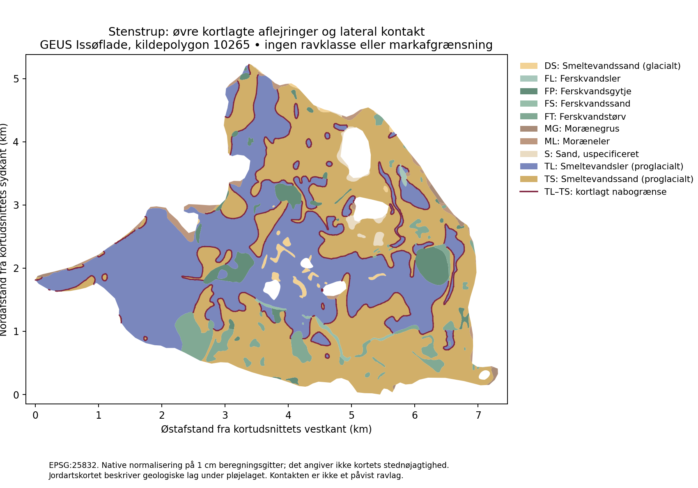

# Stenstrup: sedimentkontakter, yngre modtagere og forbindelsen til markrav

**Dato:** 2026-10-04. **Status:** regional forskningsdiagnose i den lokale Jordrav-gren. Appversion 4.0.541 og model/datasæt 0.1.0-prototype består. Analysen ændrer ingen kortklasser eller runtimefunktioner.

Den nye analyse gør Stenstrup-casen geografisk mere konkret: Den undersøgte issøflade indeholder store sand- og lerarealer, mange kortlagte nabogrænser og mindre yngre aflejringer. Det begrunder undersøgelse af flere forskellige modtagermiljøer. **Fokus på “forhøjet procespotentiale” skjuler næsten hele denne flade og kan derfor ikke bruges som en fuldstændig prioritering af marker i Stenstrup-egnen.**

Det geologiske spørgsmål er, hvor relevant materiale kan være modtaget, bevaret og senere bragt nær det bearbejdede jordlag. Kortgrænserne angiver undersøgelsesmiljøer; de dokumenterer hverken rav eller en skarp søgelinje på marken. Kendte ravfund er fortsat ikke en forudsætning.

**Senere præcisering om jagtbarhed:** Anbefalingen om alle klasser gælder
geologisk undersøgelse. Den udpeger ikke verificeret jagtbare marker.
Kortets nye jagtbarhedsvisning markerer også Stenstrup-flader som uafklarede;
TS/TL og yngre dække dokumenterer ikke i sig selv pløjeadgang eller nutidig
blotlægning. Se [jagtbarhed og dybde](JORDRAV_JAGTBARHED_DYBDE_2026-10-04.md).

## Afgrænsning og faktisk beregning

**Senere markkontekst:** Denne geologiske analyse er efterfølgende suppleret
med faktiske markregistreringer fra 2026 og publicerede JB2024-klasser.
De nye skæringer og kildeforbehold står i
[markkontekstanalysen](JORDRAV_MARKKONTEKST_STENSTRUP_2026-10-04.md).
Oplysningen nedenfor om manglende dyrkningsdata gælder dette oprindelige
analyseafsnit. Nutidig pløjning og jagtbarhed er stadig ikke verificeret.

Analysen bruger hele **kildepolygon 10265, Issøflade**, fra GEUS' geomorfologiske kort v3/2022. Den ligger i den eksisterende Stenstrup-guides navigationsvindue. Vinduet er kun brugt til at finde polygonen; der er ikke skåret et vilkårligt rektangel ud til arealberegningen. En anden, mindre Issøflade i samme vindue er ikke medtaget. Kildepolygonen afgrænser en kortlagt landskabsenhed, ikke hele den historiske sø gennem alle stadier og ikke en ravforekomst.

Den normaliserede kildeflade er **19,284 km²**. Den skæres med nyere jordartskort v7.1/2026, som dækker den med **149 kildeposter**. Ældre 1:200.000-jordarter er ikke nødvendige til denne afgrænsede beregning. Ingen eksisterende nationale supplementregler ændres.

Grundlaget er de SHA-bundne, tidligere kontrollerede **native kildegeometrier på 1 cm beregningsgitter**. Der anvendes ingen 20 m visningsgeneralisering, fundcirkler, afstandsbuffere eller udglatning. Gitteret er numerisk præcision; det gør ikke GEUS' forskellige kortmålestokke præcise på centimeterniveau. Især landskabsgrænsen i 1:200.000 er en regional fortolkning. Et detaljeret jordartsudsnit gør den ikke til en mark- eller matrikelgrænse.

Afledte skæringer og sammenlægninger udføres i fuld flydende præcision
(`grid_size=0`). Kildens allerede normaliserede koordinater ændres ikke.
Gentagen snapping af nye skæringspunkter til cm-gitteret gav i den første
diagnose en arealsumforskel på ca. 0,943 m², som en ny snapping i differenstjekket
kunne skjule. Det er rettet; både fuldpræcisions-differenser og de opløste
materialegruppers arealsum kontrolleres nu. Det ændrer ingen producent eller
national prototypegeometri.



*Egen figur fra GEUS-kildepolygonerne. Farverne viser øvre jordartssymbol, ikke ravpotentiale. Hvide indre felter ligger uden for den valgte landskabsgeometris areal. Den mørke linje viser interne kortlagte nabogrænser mellem TS og TL. Det er ikke en ravførende horisont eller et forslag om at følge linjen præcist på en mark. [Jordartskort](https://doi.org/10.22008/FK2/SQI9ZB), [geomorfologisk kort](https://doi.org/10.22008/FK2/0U6ERA).*

## Hvad materialekortet faktisk indeholder

Tallene er egne målinger af kortarealer inden for den valgte flade. De er hverken dyrkede markarealer, ravarealer eller sandsynligheder.

| Øvre symbol | Betydning i dette kildegrundlag | Areal, km² | Andel af fladen |
|---|---|---:|---:|
| TS | Proglacialt smeltevandssand | 8,913 | 46,22 % |
| TL | Proglacialt smeltevandsler | 8,086 | 41,93 % |
| FT | Ferskvandstørv | 0,844 | 4,38 % |
| FP | Ferskvandsgytje | 0,743 | 3,85 % |
| Øvrige seks symboler | ML, DS, S, FS, MG og FL | 0,698 | 3,62 % |

TS og TL er kildefilens **proglaciale smeltevandskategorier**. De omdøbes ikke til ZS/ZL, som er andre koder. Overlap med Issøflade støtter undersøgelse af et sø-/modtagermiljø, men giver ikke automatisk den enkelte jordartspolygon en bestemt alder, formation eller søfase. `S` er uspecificeret sand; en underliggende DS-kode gør ikke hele det øvre lag til en dokumenteret glacial DS-aflejring.

Sandets arealvægtede tyngdepunkt ligger omtrent **1,34 km øst** for lerets. De to tyngdepunkter har næsten samme nordkoordinat. Det passer med en overordnet øst–vest-forskel i dagens kortlagte materialer, men understøtter ikke en simpel, ensartet sydøst–nordvest-gradient gennem alle søstadier. Tyngdepunkterne er beskrivende mål for disse polygoner; de er ikke kildepunkter, transportvektorer eller søgemål.

## Procesfortolkning og dens grænser

Geopark Øhavet beskriver et hovedindløb ved Sellebjerg i sydøst med sand-/grusdelta, finere aflejring mod nordvest, senere sænkning/tømning og tilbageværende lavninger med yngre søaflejring og tørv. Det giver en regional ramme for at undersøge både tilløb, bassin og yngre modtagere. [Geopark Øhavet, Egebjerg Bakker og Stenstrup Issø](https://www.geoparkoehavet.dk/oplev-geoparken/geologi/egebjerg-bakker-og-stenstrup-issoe).

Smeds originale beskrivelse peger også på østlige/sydøstlige tilløb og en anderledes vestlig dødisbegrænsning. Den er historisk processtøtte. Deres beslægtede beskrivelser tælles ikke som to uafhængige ravbeviser, og Smeds fulde isstadiekronologi overtages ikke uændret som nutidig model. [Smed 1962, s. 50–51](https://2dgf.dk/xpdf/bull-1962-15-1-1-74.pdf).

**Vores ravhypotese:** Hvis et relevant ældre lager leverede rav til dette system, kan det være fordelt mellem flere sedimentære modtagere og omlejret senere. Lav massefylde og samtransport med organisk materiale gør det utilstrækkeligt at antage, at rav følger mineralsk grus alene. Største sandareal, største delta eller længste kontakt bliver derfor ikke automatisk bedste mark. Den fysiske begrundelse og dens forsøgsbegrænsninger står i [transportanalysen](JORDRAV_TRANSPORT_PLOEJELAG_2026-10-04.md).

Der mangler stadig en lokal tilførselskæde, som forbinder et relevant ældre lager med bestemte aflejringsstadier. Jordartskoder fastlægger ikke dette. Nutidens øvre materiale kan også afspejle senere erosion, yngre dække og kortlægningens sammenfatning. De bevarede flader kan derfor ikke alene rekonstruere hele den oprindelige søbund eller alle tilløb.

## Tre konkrete undersøgelsesspor

| Spor | Hvad der faktisk er målt | Hypotese og næste afklaring |
|---|---|---|
| **JH-012: Sand–ler-overgange** | TS og TL har ca. **44,47 km interne fælles kortgrænser**, efter opløsning af grænser inden for samme symbolgruppe. Punktberøringer og issøfladens ydergrænse tælles ikke med. | Overgangsmiljøer kan indeholde faciesvariation, erosion eller forskellig aflejring, som er relevant for en mulig ravmodtager. Et lokalt profil skal afgøre, om kontakten er samtidig, erosiv, senere forskudt eller primært et resultat af kortlægningen. Ingen fast kontaktkorridor eller bonus tilføjes. |
| **JH-013: Yngre dække over ældre materiale** | To kildeposter har FT over TS, samlet **0,117 km² / 11,74 ha**. To har FP over TL og én FT over TL; alle fem tilsammen **0,569 km²**. Kildeposterne er henholdsvis 23560/33074, 28626/28627 og 33073. | Afklar om øvre aflejring er et bevaret dække, en selvstændig yngre modtager eller begge dele. Ukendt tykkelse hindrer slutningen om adgang til pløjelaget. Erosion eller jordbearbejdning kan først vurderes, når lokal lagfølge og faktisk eksponering er kendt. |
| **JH-014: Yngre sandmodtagere** | FS fylder **0,084 km²** i den valgte flade. Dagens regel FS + bassin giver “forhøjet procespotentiale”. | Undersøg om ferskvandssandet faktisk har modtaget materiale fra en relevant ældre enhed. Kortkategorien og den eksisterende klasse dokumenterer ikke opland, alder, ravtilførsel eller bedre fundchance end TS/TL-miljøerne. |

JH-012 er en **lateral naborelation**. JH-013 er et **øvre/dybere symbolpar**. De kan ikke erstatte hinanden: En sandflade ved siden af tørv beviser ikke sand under tørven, og FT/TS beviser ikke, at en aktuel plov når TS. Selv ens øvre/dybere symboler afklarer ikke hele lagpakken eller dybere kontakter. GEUS' kortlægningsmetode beskriver oprindelige geologiske aflejringer under pløjelaget, ikke en særskilt prøve af rav i dyrket topjord. [GEUS 2025/32](https://data.geus.dk/pure-pdf/GEUS-R_2025_32_web.pdf).

Alle tre er undersøgelseshypoteser med svag ravspecifik sikkerhed. De er ikke indbyrdes vægtet eller rangordnet efter mængde. En ravirrelevant tilførsel, forkert tidslig forbindelse eller utilgængelig lagpakke svækker den berørte kæde. Manglende tidligere ravfund gør ikke hypotesen ugyldig.

## Konsekvens for markvalg og regn

Ved gennemgang af Stenstrup skal kortet stå på **alle potentialeklasser**. Analysen af de uændrede regler giver kun **0,43 % forhøjet** og **99,57 % muligt** i denne flade. Næsten alle TS/TL-kontakter og de fem differentierede organiske symbolpar skjules ved fokus på forhøjet. Det er en begrænsning i, hvad filteret viser; det er ikke et empirisk bevis for, at 99,57 % er mindre egnet til rav.

For en konkret mark er næste relevante afklaring derfor, hvilket af de tre miljøer den ligger i, om laget kan forbindes med en plausibel tilførsel, og om materiale faktisk er blotlagt i det bearbejdede jordlag. En eventuel senere feltundersøgelse kan sammenholde begge sider af en overgang og yngre modtagere under nogenlunde sammenlignelige synlighedsforhold. Der indføres ikke en funddatabase eller et nyt pointsystem.

Ejerens praktiske observation om **pløjning → blotlægning → regn → afvaskning/synlighed** består. Den kan ikke bruges til at antage, at mere regn altid er bedre. Geoparken beskriver stående vand og meget klæg overfladejord på de fede lerjorde i regnperioder. **Vores praktiske slutning** er, at afvaskning, nyt slam og faktisk synlighed bør vurderes på marken frem for via en universel millimetertærskel. [Geopark Øhavet](https://www.geoparkoehavet.dk/oplev-geoparken/geologi/egebjerg-bakker-og-stenstrup-issoe).

Almindeligt kort og luftfoto hjælper med orientering og synlige landskabsforhold. De daterer ikke lagene, viser ikke dæklagstykkelse og dokumenterer ikke dagens pløjning eller regn. Denne analyse har ingen aktuelle dyrknings-, terrænhøjde- eller feltobservationsdata og udpeger derfor ikke navngivne ejendomme eller konkrete dyrkede marker som verificerede ravsteder.

## Gentagelighed og udført kontrol

[audit_stenstrup_contacts.py](jordrav/audit_stenstrup_contacts.py) kontrollerer kildecache-/regelidentiteter, udvælger native polygonen, opløser øvre symbolgrupper og beregner interne kontakter. [Auditresultatet](jordrav/stenstrup-contact-audit-2026-10-04.json) indeholder alle 149 jordartskilde-ID'er, øvre/dybere par, arealer og kontaktlængder. Native partition: **0,000000 m²** rapporteret hul, overskud og overlap; kontroltolerancen er 1 m². Det er numerisk konsistens, ikke stednøjagtighed eller validering af ravhypoteser.

En uafhængig læsning af **originale SHP/DBF-filer** med pyshp, uden cm-normalisering, kontrollerer de 149 symbolpar og genberegner hovedmålingerne. [verify_stenstrup_originals.py](jordrav/verify_stenstrup_originals.py) og [resultatet](jordrav/stenstrup-original-verification-2026-10-04.json) er PASS. Original søflade er 19,284395 km² mod normaliseret 19,284406 km²; forskellen er 10,673 m². TS–TL-kontaktlængderne afviger ca. 0,05 m. Den ene ugyldige originale regionale jordartspost er behandlet med `make_valid` i hukommelsen; originalfiler og den frosne cache er urørte. Sammenfaldende beregningsresultater er ikke uafhængige geologiske ravbeviser.

Figuren er fremstillet med Matplotlib og visuelt kontrolleret. Afhængighederne er isoleret i temp-mappen; ingen runtimeafhængighed føjes til appen. De udførende scripts kræver shapely/pyproj/pyshp; figurbygning kræver desuden Matplotlib. Eksempel fra repositoryroden med disse afhængigheder tilgængelige:

De to nye scripts og deres JSON-resultater har bytebevarende Git-attributter.
Den tidligere kildecacherapports tekst bindes med eksplicit LF-normaliseret
UTF-8-hash, så Windows/Linux-linjeskift ikke forveksles med ændrede kildefakta.

```text
python -B docs/research/jordrav/audit_stenstrup_contacts.py --source-root <offentlig-kildecache> --output docs/research/jordrav/stenstrup-contact-audit-2026-10-04.json --figure docs/research/jordrav/stenstrup-native-contacts.png
python -B docs/research/jordrav/verify_stenstrup_originals.py --source-root <offentlig-kildecache> --audit docs/research/jordrav/stenstrup-contact-audit-2026-10-04.json --output docs/research/jordrav/stenstrup-original-verification-2026-10-04.json
```

RDKS, åbne issues, changelog, Markdown-håndbogen og det forberedte webhåndbogstillæg følger denne analyse. Ingen app-/modelversion, klasseregler, nationale geometrier, UI, vejr, Supabase eller aktiv webhåndbog ændres. Lokal preview forbliver stoppet, indtil ejeren ønsker kortet åbnet. Tidligere browserkontroller er dateret evidens for den uændrede brugerflade; ingen ny CI-, deploy- eller produktionsverifikation påstås.

Slutkontrol: native audit, originalfilskontrol, Python-syntaks, script-/model-/
rapportbinding, materiale- og symbolparsummer, lokale links, håndbogstillæg,
RDKS og eksisterende sikkerhedshærdningskontrakter PASS. Den tidligere
arealsumfejl er dokumenteret og rettet. Figur og faglige begrænsninger er læst.
