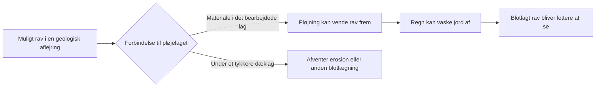

# Jordrav fra sedimenttransport til synlige fund på pløjede marker

> Historisk kortstatus: denne rapport blev udført med model 0.1.
> Nationale farver og klasseregler er siden revideret i
> [model 0.2](JORDRAV_NATIONAL_MODEL_0_2.md). Rapportens kildeobservationer
> bevares; udsagn om frosne regler, guide-only levering og åbne nationale
> farveændringer er supersederet. Gamle regelbundne audits reproduceres
> fra commit eee7b08e.

**Dato:** 4. oktober 2026. **Status:** videre faglig analyse og lokal forbedring af forklaringerne. Kortets model og datasæt er fortsat 0.1.0-prototype. Ingen ny funddatabase, ravprocenter eller apprelease.

Den vigtigste nye konklusion er, at en geologisk interessant aflejring og en god mark at afsøge kræver to forskellige vurderinger. Den første følger tilførsel, sortering og bevaring gennem sedimenthistorien. Den anden undersøger forbindelsen til pløjelaget og ravets synlighed efter jordbearbejdning og regn. En stærk forklaring skal forbinde begge forløb. Sand ved én meters dybde er ikke tilstrækkeligt til at forudsige synligt markrav.

Ejerens aktuelle præcisering er indarbejdet: Rav findes gerne på pløjede marker, og efterfølgende regn kan vaske jord af stykkerne, så de bliver synlige. Dette behandles som praktisk erfaringsgrundlag og en plausibel fundmekanisme; der er ikke udledt en målt fundhyppighed. Analysen nedenfor undersøger, hvad mekanismen kræver af kortet.

## Transporten kan ikke udledes af mineralsk kornstørrelse alene

Et direkte laboratoriestudie anvendte kugleformede ravpartikler på 5 mm. Den målte densitet var 1.041,3 ± 8,3 kg/m³, og synkehastigheden i destilleret vand var 0,0717 ± 0,0025 m/s. Forsøgene viste ravtransport tæt ved bunden med springende bevægelse. Partiklerne blev undersøgt i en kanal med fastgjorte sandkorn på bunden, ikke i et naturligt dansk smeltevandsløb. Formen var kontrolleret og repræsenterer ikke alle naturlige ravstykker. Tallene og forsøgsgrænserne er læst i tabel 1–2 og metodeafsnittene 2.1–2.3. [Lofty m.fl. 2023, s. 2–4](https://orca.cardiff.ac.uk/id/eprint/161026/1/1-s2.0-S0043135423007650-main.pdf).

**Egen fysisk udledning:** Ravets vægt under vand afhænger af densitetsforskellen til vandet: `F = (ρ_rav − ρ_vand) × g × V`, hvor V er volumen og g tyngdeaccelerationen. Sammenligner vi samme volumen af det målte rav med et illustrativt kvartskorn på 2.650 kg/m³ i vand på 1.000 kg/m³, bliver forholdet `41,3 / 1.650`, cirka 2,5 %. Det er et regneeksempel om nedsænket vægt. Det er hverken en tærskel for bevægelse, en transportafstand eller en koncentrationsfaktor. Modstand, form, bundkontakt og turbulens skal stadig vurderes.

**Vores geologiske slutning:** En strøm kan transportere et ravstykke på en anden måde end et lige stort mineralsk gruskorn. Derfor kan “grus” ikke generelt rangordnes over “fint sand” som ravmodtager. En sandaflejring kan indeholde spor af let materiale, som ikke følger sedimentets dominerende mineralske kornstørrelse. Omvendt gør lav densitet ikke rav til en fri overfladetracer: Det undersøgte rav var tungere end ferskvand og sank i stillestående vand.

Den næste faglige prioritet er lagstrukturen: tynde organiske lag, skift mellem strømførende og roligere aflejring, erosionskontakter og modtagerlag. Disse er **mulige undersøgelsesmål**, ikke automatisk ravførende enheder. Den nationale jordartskode angiver dominerende materiale og kan ikke alene lokalisere et tyndt ravrelevant lag.

## Tilførsel og koncentration kan udvikle sig forskelligt

En ravkæde skal forklare, hvilket muligt lager der blev eroderet, hvor materialet kom hen, og hvorfor noget kunne blive tilbage. Det er ikke nok, at der både findes en sandbakke og et bassin på kortet. Der skal være en mulig forbindelse i den rigtige tidsrækkefølge.

**Egen modelbetragtning:** En modtager kan få større samlet ravmængde og samtidig lavere koncentration, hvis der tilføres langt mere ravfattigt sediment. Omvendt kan udvaskning fjerne en del af mineralsedimentet og efterlade en højere lokal andel af rav, uden at tilføre nyt rav. Gentagen omlejring kan derfor både samle, fortynde og fjerne materiale. Antallet af istider eller transporter er ikke en meningsfuld automatisk bonus.

Der er tre forskellige undersøgelsesmål:

- **Bevaret lager:** Et ældre lag eller en flyttet sedimentflage kan have bevaret en intern lagstruktur. Her er lagkorrelation vigtigere end kort afstand til et historisk fund.
- **Yngre modtager:** Erosion og vandtransport kan have afleveret materiale i en dal, et indløb eller et bassin. Her skal både fødesediment og modtagerhistorie vurderes.
- **Senere blotlægning:** Dyrkning eller erosion kan forbinde et bevaret lag med overfladen. Her er dæklag og lagets aktuelle position afgørende.

Denne opdeling giver muligheder på tværs af jordarter. Den historiske ravbeskrivelse fra yngre ler ved Stenstrup og Allerød er allerede undersøgt i [den regionale analyse](JORDRAV_REGIONALE_KAEDER_2026-10-04.md). Den støtter, at yngre finere modtagere kan være relevante; den fastslår ikke, at alle bassinlerlag har samme tilførsel.

## Bevaring kræver sin egen forklaring

Begravelse kan beskytte et muligt lager mod senere fjernelse og samtidig gøre det utilgængeligt for markfund. Blotlægning kan forbedre fundbarheden og samtidig udsætte materialet for overfladeprocesser. Derfor kan bevaring og nutidig synlighed pege i forskellige retninger.

Et forsøg med pressede pellets af baltisk ravpulver og accelereret termisk ældning fandt oxidation koncentreret ved overfladen. Det er mekanistisk støtte til, at overfladeeksponering har betydning. Her anvendes den publicerede sammenfatning; forsøget må ikke omsættes til en årlig nedbrydningsrate i danske marker eller til en automatisk fordel for tørv eller vådt ler. [Pastorelli, Richter & Shashoua 2012, abstract](https://www.sciencedirect.com/science/article/abs/pii/S1386142512000042).

**Vores videre slutning:** Organisk eller finkornet dække skal vurderes med to spørgsmål: Kan det være en modtager eller beskyttende overlejring, og kan det relevante rav være inden for rækkevidde af nutidig jordbearbejdning? Et tykt dæklag kan være interessant for den første vurdering og svagt belyst for den anden. “Organisk materiale” kan desuden være både en senere aflejring og omlejret gammelt materiale; ens kortfarve betyder ikke ens ravhistorie.

## Pløjning og regn forbinder lageret med et synligt fund

**Praktisk mekanisme fra ejeren:** Pløjning kan bringe rav fra det bearbejdede lag op på den nye jordoverflade. Regn kan fjerne jord, som skjuler eller tilsmudser allerede blotlagte stykker. Der behøver således ikke at være ny ravtilførsel, for at en mark bliver bedre at afsøge. Et luftfoto og et geologisk kort kan beskrive landskab og mulige sedimenter, mens dagens jordbearbejdning, vegetation og afvaskning er separate forhold.

**Vores observationsmodel:** Antallet af synlige stykker afhænger både af rav i det bearbejdede materiale, den del som er blotlagt, afvaskning og den del som faktisk bemærkes. Faktorerne er betingede af hinanden og er ikke antaget uafhængige. Der er ingen talværdier eller procentberegning i prototypen. En forgæves afsøgning før regn eller på en tæt bevokset mark er derfor ikke automatisk negativ evidens mod den geologiske hypotese.

Et ældre eksperiment med overfladeindsamling af arkæologiske genstande undersøgte nedbør og jordforhold og fandt ændret genfinding efter regn. Genstandsstørrelse påvirkede også sammenligningen mellem overflade og pløjelag. Her er kun universitetets originale abstract gennemgået. Det er en **analogi om synlighed**, ikke et ravstudie; nedbørsmængderne og resultaterne bruges ikke som ravtærskler. [Turner 1986](https://trace.tennessee.edu/handle/20.500.14382/40300).

**Konkret anvendelse:** Undersøg først en sammenhængende sedimentmulighed. Vurder derefter, om det relevante materiale kan indgå i jordbearbejdningen, og om jordoverfladen faktisk er blotlagt. Regn efter pløjning kan være en fordel for synligheden efter ejerens erfaring. Der er ikke belæg for et universelt antal millimeter, en fast ventetid eller en fast fundbonus. Kraftig afstrømning er en anden proces end ren afvaskning og kan omfordele materiale; den kan ikke antages at forbedre enhver mark.

## Jordartskortet er ikke en prøve af pløjelaget

GEUS beskriver kortlægning omkring én meters dybde, valgt for at komme under pløjelaget og beskrive den oprindelige geologiske aflejring. Dobbelt symbol angiver forskellige aflejringer inden for den øverste meter; det nederste beskriver aflejringen omkring én meter. Det øvre symbol beskriver den overliggende geologiske aflejring, ikke en særskilt analyse af nutidens bearbejdede muldlag. Præcis lagtykkelse følger ikke af symbolerne. [GEUS 2025/32, s. 4, 7 og 10](https://data.geus.dk/pure-pdf/GEUS-R_2025_32_web.pdf).

Det har en direkte konsekvens for fortolkningen: `jsym1 == jsym2` dokumenterer ikke, at rav kan pløjes frem. Forskellige symboler dokumenterer heller ikke, om en plov kan nå den nedre aflejring. De understøtter en overfladenær **geologisk** vurdering, hvis forbindelse til pløjelaget kræver særskilt belæg. Prototypens kategori `near-surface` er derfor en intern beskrivelse af kortgrundlaget og må ikke læses som verificeret marktilgængelighed.

Kortets danske, tyske og engelske forklaringer er rettet til **øvre kortlagte aflejring**, og overfladerelevansen forklarer nu denne dybdegrænse. En særskilt markguide beskriver pløjning, regn, synlighed og forbindelsen til laget. Der tilføjes ingen vejrhentning eller datobestemt markscore.

## Hvad gennemgangen af hele datasættet viser

Den nye [diagnose](jordrav/process-focus-diagnostic-2026-10-04.json) gennemgår alle 192 udsnit og 505.834 eksporterede polygonfragmenter. Den kontrollerer filernes SHA-identiteter og modelbinding og summerer de **20 m generaliserede visningspolygoner** efter inverse projektion til EPSG:25832. Fragmenter er ikke uafhængige lokaliteter, marker eller fund. Metoden findes i [diagnose_process_focus.py](jordrav/diagnose_process_focus.py).

| Spørgsmål i den eksisterende prototype | Omtrentlig visningsflade | Faglig betydning |
|---|---:|---|
| Marint sand/grus på marine flader, som ligger uden for forhøjet fokus | 2.128 km² | Mulige tidligere havmodtagere; sandkoden alene påviser ikke en kyst eller ravtilførsel |
| Finkornede glaciale, marine eller ferske sedimenter i bassinmiljøer uden for fokus | 84,7 km² | Mulige yngre modtagere, som ikke skal afvises alene på grund af ler/silt |
| Sand/grus fra glaciale bassiner i bassin-, smeltevands- eller erosionsmiljøer uden for fokus | 1,44 km² | Reglerne fremhæver ikke disse par; en eventuel udvidelse kræver begrundet sammenligning |
| Flyvesand eller organisk dække over en grov dybdekode | 677,8 km² | Mulige underliggende lag, men uden oplysning om præcis lagtykkelse eller pløjerelevans |
| Forhøjet klasse med forskellige øvre og nedre symboler | 35,7 km² | Selv fremhævede polygoner kan have en uafklaret relation til pløjelaget |

Rækkerne er spørgsmål og må overlappe. De er hverken nye ravområder, opgraderinger eller arealer med påvist rav. Tallene er en diagnose af **modellens valg af miljøer**, ikke en national fundrangliste. Det marine spørgsmål rummer både nyere materiale og ældre supplement; det er ikke ét bestemt dansk havstadium.

Den samlede visningsflade er cirka 43.785,7 km². Den beskriver modellens geologiske footprint og omfatter kortenes egne kyst-/vand- og særlige kategorier; den er ikke en ny opmåling af Danmarks landareal. Forhøjet udgør cirka 5.355,7 km² af visningsfladen, mens bygningens native kildeareal for samme klasse er cirka 5.348,9 km². Forskellen på cirka 6,81 km² skyldes de anvendte visningsgeometrier og opgøres særskilt. Kildeareal og visningsareal må ikke byttes om. Små rækketal angives kun for at kunne gentage diagnosen, ikke som tilsvarende geografisk præcision.

**Konsekvens for brugeren:** “Vis kun forhøjet procespotentiale” er et snævert fokus, som skjuler reelle undersøgelseskandidater i de øvrige klasser. Hjælpeteksten er præciseret. Klassen “muligt” er fortsat fagligt relevant. Der sker ingen omklassificering ud fra disse totalsummer.

## Vendsyssel udvider den regionale analyse til tidligere havmiljøer

GEUS' materiale forklarer, at senglacialt marint sand i Vendsyssel både kan være afsat i kystzonen og på dybere vand. Derfor er YS ikke i sig selv en gammel strandvold. [GEUS 2025/32, s. 20](https://data.geus.dk/pure-pdf/GEUS-R_2025_32_web.pdf).

Christensen og Nielsen beskriver ved Yderhede marine og brakvandsaflejringer, flere transgressions-/regressionsfaser og et lokalt højt havniveau omkring 13 m over nutidens hav. Artiklen fremhæver, at den markante regionale kystskrænt muligvis er senglacial frem for dannet under Littorinahavet. Her anvendes det originale abstract, ikke en gennemgang af hele artiklen. [Christensen & Nielsen 2008](https://pub.geus.dk/en/publications/dating-littorina-sea-shore-levels-in-denmark-on-the-basis-of-data/).

**Vores ravhypotese:** Gentagen erosion og kystomlejring kan forbinde ældre sedimenter med yngre sandlag, lagkontakter og strandvoldsmiljøer. Den interessante analyse følger sedimentkontakter og den lokale havhistorie, ikke en landsdækkende højdekurve. I det hævede landskab skal en mulig modtager desuden kunne forbindes med pløjelaget eller en anden nutidig blotlægning. Ingen af de to kilder påviser rav i de nye kandidatpolygoner.

**JH-009:** Kan en kandidat knyttes til et bestemt kyst-/havstadium og en plausibel fødekilde, og ligger det relevante materiale inden for nutidig blotlægning? Hypotesen ændres, hvis sandet er en anden dybvandsenhed, hvis fødelageret mangler, eller hvis yngre dække afbryder forbindelsen til overfladen. En tidligere kysthøjde kan ikke anvendes uændret på hele Danmark eller som bevis for samme alder.

Denne femte case er tilføjet den regionale guide på DA/DE/EN. Navigationsvinduet er omtrentligt og afgrænser ingen ravforekomst. Kortets eksisterende fire klasser og datasæt er uændrede.

## Den næste præcisering skal følge lag og pløjelag

Dette trin er nu konkret efterprøvet med to aktuelle offentlige Jupiterprofiler
og punktopslag i prototypens visningsflader. Se [boringer og lagforbindelse](JORDRAV_BORINGER_LAGFORBINDELSE_2026-10-04.md).
Den nedenstående metode er dermed delvist udført; regional dækning og aktuelle
markprofiler er fortsat åbne. Ingen ny national boringsfil eller klasseændring.

En bedre regional prioritering kan bygges i tre adskilte trin: **mulig tilførsel og modtagelse**, **lagets bevaring og dybde** og **aktuel eksponering og synlighed**. Trinene skal have egne forklaringer og usikkerheder. Der er ikke fagligt grundlag for at lægge dem sammen med faste vægte.

GEUS' nationale boringsdatabase Jupiter stiller geologiske boreoplysninger til rådighed. Sådanne oplysninger kan bruges til at undersøge lagrækkefølge og dæklag uden at kræve et ravfund. Den officielle adgangsbeskrivelse er kontrolleret; der er ikke hentet eller integreret en ny landsdækkende boringsfil. [GEUS, adgang til Jupiterdata](https://www.geus.dk/produkter-ydelser-og-faciliteter/data-og-kort/national-boringsdatabase-jupiter/adgang-til-data/).

**Vores metodeforslag:** Begynd med korrelerbare profiler i én egn, og registrer hvad boringen faktisk beskriver. “Ingen rav nævnt” er ikke en målrettet negativ ravprøve. En boring ved siden af en mark kræver desuden vurdering af lagets sammenhæng, terræn og kildepræcision. En automatisk radius omkring boringen ville gentage problemet med historiske fundcirkler.

Landbrugsareal, bare jordflader og terrænerosion kan senere være kontekst til **fundbarhed**, hvis deres kilde og aktualitet er dokumenteret. Et luftfoto alene afgør hverken lagdybde eller dagens tilstand. Geologisk analyse på arealer uden kendte fund er fortsat mulig og nødvendig; stærkere sikkerhed kan opnås fra sammenhængende stratigrafi, ikke kun fra fundregistrering.

## Kildekontrol og lokal validering

Loftys tabel og forsøgsmetode er læst i originalartiklens tekst; PDF'ens billeder kunne ikke hentes til visuel kontrol. De centrale GEUS-metodeafsnit og legendekoder er læst i originalrapporten; s. 4 om kortlægning under pløjelaget er også visuelt kontrolleret. Christensen & Nielsen, Turner og Pastorelli er anvendt med eksplicit abstractgrænse. Mislykkede PDF-hentninger bruges ikke som fuldtekstevidens. Ejerens praktiske erfaring er adskilt fra forsøg og vores egne udledninger.

Den read-only datadiagnose PASS for alle 192 udsnit og 505.834 fragmenter. De 12 lokale browserkontroller omfatter fem regionale cases, markguiden på mobil og DA/DE/EN samt de eksisterende kort-, valg-, fokus- og fejlforløb. Endelig kilde-/dokumentationskontrol registreres i forskningscheckpointet. Ingen CI-, produktions- eller fysisk mobilverifikation påstås.
